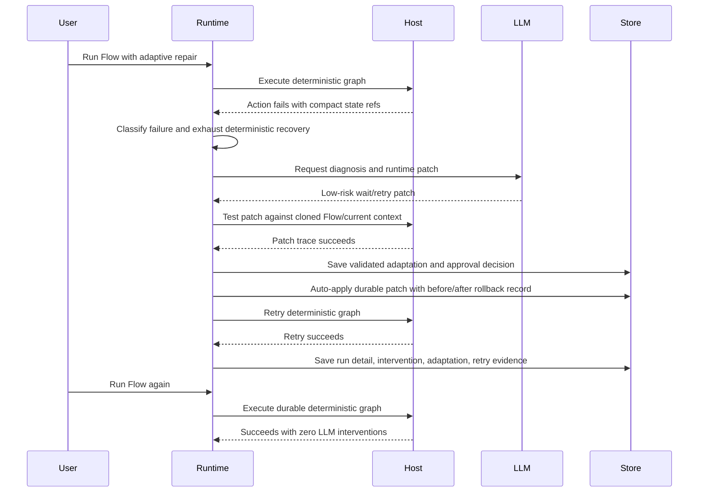

# LLM-Assisted Deterministic Automation Expansion Plan

Status: working document  
Scope: FluxIQ core product direction, Automation Studio, Flow runtime,
LLM-assisted adaptation, training history, and persistence contracts.  
Related plans:

- `docs/working/flow-unification-and-scriptability-plan.md`
- `docs/working/runtime-kernel-plan.md`
- `docs/working/adaptive-flow-training-roadmap.md`
- `docs/working/automation-studio-load-performance-plan.md`
- `docs/architecture/automation-studio.md`
- `docs/architecture/automation-studio/persistence.md`

## Purpose

FluxIQ's core value proposition is not "an LLM agent that performs every
automation step." FluxIQ should use LLMs as a harness for generating, repairing,
adapting, and improving deterministic automation, then compile successful
reasoning into reusable Flow structure so stable executions do not keep paying
for token usage.

The product invariant is:

> LLM usage should scale with novelty, ambiguity, and environment drift, not
> with execution volume.

If a behavior can be expressed with declared inputs, observable state, available
actions, expected outputs, user instructions, and deterministic routing, FluxIQ
should learn to run it without asking an LLM on every execution. The LLM is the
runtime trainer and repair assistant. The saved Flow is the durable automation.

## Core Mental Model

The new architecture is:

```text
Describe, configure, or demonstrate
  -> generate initial Flow
  -> execute deterministic router/subflow
  -> observe actual state
  -> detect divergence
  -> try known recovery or reroute
  -> invoke LLM only when compiled knowledge fails
  -> test proposed runtime patch live
  -> record the adaptation
  -> promote validated behavior into router/subflows
  -> run cheaply next time
```

The LLM should act like a developer working on the automation while it runs.
When it solves a new situation, FluxIQ stores the solution structurally so the
same situation becomes deterministic later.

## Input Channels

Text description and scoped user instructions become the primary authoring
input for most Flows. A user should be able to describe desired inputs,
outputs, constraints, preferred behavior, and recovery preferences without
recording a human demonstration.

Human recordings remain valuable, but they are no longer the central assumption
of the product. Recordings are an optional high-signal aid when:

- the task is easier to demonstrate than explain;
- the domain state is hard to describe precisely in text;
- the user wants FluxIQ to imitate an existing manual process;
- the automation is valuable enough to justify capture effort;
- the recording provides edge-case evidence that text instructions cannot
  convey cleanly.

Runs and adaptations should become more important over time than original
human recordings. The best evidence for a mature Flow is how FluxIQ actually
performed, where it diverged, and which deterministic changes made future runs
stable.

## Product Vocabulary

| Term | Meaning |
| --- | --- |
| Flow | The complete automation artifact. It owns interface, router, subflows, instructions, recordings, runs, adaptations, settings, provenance, and publication lifecycle. |
| Router | The top-level deterministic decision layer inside a Flow. It selects subflows based on inputs, state, context, and learned route rules. |
| Subflow | A reusable unit of behavior under a Flow, often scoped to a site, screen, task category, recovery pattern, integration step, or domain-specific state class. |
| Run | A first-class execution record containing inputs, route decisions, subflows entered, actions, state snapshots, expectations, failures, recoveries, LLM interventions, modifications, and outcome. |
| Recording | Optional human demonstration evidence. It remains immutable input for generation, repair, and comparison when demonstration is more useful than text. |
| Instruction | User-authored guidance scoped to global, Flow, router, subflow, node, runtime, or error-handling contexts. Instructions shape LLM generation/adaptation but do not bypass validation or policy. |
| Change proposal | A lightweight approval checkpoint for generated edits, new subflows, router changes, and adaptation promotion. Proposals are not recording-generated artifacts; they are the review gate around structural changes. |
| Adaptation | An explicit proposed or applied change created from runtime evidence, usually after recovery, reroute, or LLM intervention. |
| Adaptation policy | The per-Flow permission and autonomy setting controlling what FluxIQ may observe, repair, persist, rewrite, delete, or submit for approval. |
| LLM harness | The constrained orchestration layer that prepares context, asks for a minimal patch or diagnosis, validates output, and turns successful work into explicit artifacts. |

## Target Flow Shape

A Flow should be presented as one product object with multiple inner views:

```text
Flow: Purchase Product
  Router
  Subflows
    Amazon
      Search
      Product Page
      Add To Cart
      Checkout
    Walmart
      Search
      Checkout
    Recovery
      Login
      Popup Handling
      Unexpected State
  Recordings
  Runs
  Adaptations
  Instructions
  Settings
```

The router is not a separate top-level artifact competing with Flow. It is a
component of the Flow. The router is usually deterministic; the LLM edits it,
tests changes, and proposes new route rules when runtime evidence proves a
missing branch.

## Runtime Intervention Ladder

Runtime adaptation should follow an intervention ladder before invoking the
LLM:

```text
Execute expected action
  -> expected state reached?
       yes: continue
       no:
  -> known recovery path?
       yes: execute recovery
       no:
  -> another known subflow matches current state?
       yes: reroute
       no:
  -> LLM intervention
       diagnose, patch, test, record adaptation
```

The LLM receives a compact, structured context:

- Flow, router, current subflow, and selected node/region;
- current inputs and authorized capabilities;
- current state and expected state;
- failed action, action result, and recent action history;
- relevant previous runs and recordings;
- scoped user instructions for global, Flow, router, subflow, node, runtime, or
  error contexts;
- available actions, node definitions, and subflow inventory;
- known accepted, pending, rejected, and disabled adaptations;
- adaptation policy for the Flow and current actor.

The LLM should return an execution patch or structural patch, not open-ended
agent behavior. Example:

```text
Runtime patch:
1. Click "Skip offer".
2. Wait until subscription modal is hidden.
3. Retry Checkout.Payment.

If successful:
Create recovery subflow "Dismiss subscription offer".
Add router rule before Checkout.Payment:
  when subscription_offer_modal.visible == true
  route to Recovery.DismissSubscriptionOffer
```

## Adaptation Policies

Adaptive behavior should be the default product stance, but it must not be a
single unsafe on/off switch. Each Flow owns an adaptation policy.

Suggested presets:

| Preset | Runtime LLM | Persist changes | Structural edits | Destructive edits |
| --- | --- | --- | --- | --- |
| Locked | No | No | No | No |
| Observe | Analyze only | No | No | No |
| Repair | Recover current run | Approval required | Approval required | No |
| Adaptive | Recover current run | Yes for validated safe patches | Approval for major rewrites | Approval required |
| Autonomous | Recover and restructure | Yes within policy gates | Yes within policy gates | Approval required |

Granular permissions:

- runtime recovery;
- create recovery paths;
- modify subflows;
- create subflows;
- modify router rules;
- create route categories;
- modify expectations;
- modify action targets;
- delete or disable behavior;
- run external side effects;
- publish or promote adaptations.

Initial default should be `Adaptive` with conservative gates:

- non-destructive recovery may run automatically;
- successful low-risk recovery paths may be persisted;
- router/subflow rewrites require validation thresholds;
- deletion and external side effects require approval.

## Scoped User Instructions

Users need a direct way to tell FluxIQ how to reason, recover, and edit without
turning every preference into graph structure up front. Instructions are
first-class configuration consumed by the LLM harness during generation,
runtime repair, adaptation review, and periodic improvement.

Instruction scopes:

| Scope | Purpose |
| --- | --- |
| Global | Default user or workspace preferences that apply across Flows. |
| Project | Team or project-specific standards, naming, safety, and style guidance. |
| Flow | Goal, constraints, success criteria, forbidden behavior, and preferred strategy for the whole Flow. |
| Router | Routing priorities, fallback strategy, ambiguity handling, and category creation guidance. |
| Subflow | Behavior specific to one subflow, site, screen, integration, or recovery category. |
| Node or region | Fine-grained guidance for one action, state expectation, policy region, or generated code block. |
| On error | Instructions used only when expected state diverges, an action fails, or a recovery ladder reaches LLM intervention. |
| Adaptation review | Guidance for whether changes should be conservative, aggressive, automatically promoted, or approval-only. |

Instruction records should include:

- stable ID, owner scope, title, body, priority, and status;
- optional tags such as `generation`, `runtime`, `error`, `router`,
  `subflow`, `review`, or `safety`;
- effective policy gates and whether the instruction is advisory or required;
- source actor and timestamps;
- optional links to runs, adaptations, recordings, or subflows that motivated
  the instruction.

Instructions are not executable authority. They shape LLM proposals, but every
result still passes validation, adaptation policy, capability checks, and
approval gates. Conflicting instructions should be surfaced as diagnostics, not
silently resolved by prompt order.

## Change Proposal Gate

The old recording-derived proposal model should be replaced by a simple
approval checkpoint for structural changes. A proposal is effectively a rubber
checkmark gate that can be automatic or manual depending on Flow policy.

By default, safe generated changes are allowed to pass through automatically
after validation. Users can switch the Flow, project, or specific subflow to
manual approval only.

Proposal scope:

- creating a new subflow;
- editing an existing subflow;
- adding or changing router rules;
- promoting a validated adaptation into durable Flow structure;
- changing expectations, action targets, or recovery paths;
- applying user-instruction suggestions that alter runtime behavior.

Non-goals:

- Proposals are not generated directly from recordings.
- A recording may provide evidence or context, but it does not create a
  proposal as a direct pipeline step.
- Proposal approval does not replace validation, capability checks, adaptation
  policy, or side-effect authorization.

Proposal modes:

| Mode | Behavior |
| --- | --- |
| Auto | Validated low-risk changes pass automatically and are recorded for audit. |
| Manual | Every structural change waits for user approval. |
| Mixed | Low-risk changes pass automatically; major router/subflow/external-effect changes require approval. |

The UI should make this feel lightweight: approve, reject, inspect diff, or set
the scope to auto/manual. It should not recreate the old heavyweight generated
proposal workbench.

## First-Class Run Records

Previous runs are not merely logs. Runs are training evidence.

Each run should persist:

- run ID, Flow ID, version, actor, inputs, settings, and authorized domains;
- starting state and relevant environment metadata;
- router decisions and route rule matches;
- subflows entered and exited;
- actions executed, action attempts, results, timing, retries, and failures;
- state snapshots, deltas, expectations, and comparisons;
- recovery paths attempted;
- reroutes attempted;
- LLM interventions, including context package summary, prompt version,
  structured result, proposed patch, and execution result;
- adaptations created, updated, accepted, rejected, disabled, or promoted;
- Flow modifications applied during or after the run;
- outcome, confidence, costs, and token usage.

Runs provide the most important long-term evidence:

- successful runs show what FluxIQ successfully did;
- failed or adapted runs show where reality diverged and what fixed it;
- optional recordings show what the human did when demonstration was useful;
- scoped instructions explain what the user wanted FluxIQ to optimize for.

## First-Class Adaptation Records

Adaptations should never be silent edits hidden inside a Flow. They are
inspectable, reversible, mergeable artifacts.

Adaptation record shape:

```text
Adaptation
  id
  flowId
  sourceRunId
  sourceRecordingIds
  trigger
  observedState
  expectedState
  failedAction
  diagnosis
  patch
  validationResults
  appliedTo
  status
  author
  createdAt
  updatedAt
  riskLevel
  approval
```

Statuses:

- proposed;
- testing;
- validated;
- applied;
- rejected;
- disabled;
- reverted;
- superseded.

Users must be able to inspect, approve, reject, revert, promote, disable, and
compare adaptations. This keeps adaptive automation transparent instead of
turning into an inscrutable generated system.

## Domain Boundary

FluxIQ remains domain-neutral. Importing repositories own domain-specific
meaning and executable capabilities.

Domains provide:

- observations and state snapshots;
- event streams;
- action definitions;
- action execution adapters;
- action results;
- optional semantic mappers;
- capability and safety metadata.

FluxIQ provides:

- Flow/router/subflow contracts;
- runtime execution;
- state comparison and divergence detection;
- run history;
- adaptation records;
- LLM context packing and structured patch validation;
- promotion/review workflows;
- persistence, UI, and API surfaces.

As a design test, if a feature requires private domain knowledge in FluxIQ core,
it belongs in an importing repository or a domain adapter instead.

## Persistence Target

Project persistence should evolve from:

```text
projects/{projectId}/
  indexes/
    flows.json
    runtime.json
  flows/{flowId}/flow.json
  recordings/{recordingId}/...
  runtime/runs/{runId}/...
```

to:

```text
projects/{projectId}/
  indexes/
    flows.json
    routers.json
    subflows.json
    instructions.json
    change-proposals.json
    recordings.json
    runs.json
    adaptations.json
    objects.json

  flows/{flowId}/
    flow.json
    router.json
    settings.json
    instructions/
    source/
    publications/
    subflows/{subflowId}/subflow.json
    subflows/{subflowId}/instructions/
    proposals/{proposalId}/proposal.json
    adaptations/{adaptationId}/adaptation.json

  recordings/{recordingId}/...

  runtime/runs/{runId}/
    run.json
    route.jsonl
    actions.jsonl
    state.jsonl
    interventions.jsonl
    adaptations.jsonl
```

Indexes must stay lightweight. Project open should read summaries only. Detail
views fetch one Flow, subflow, instruction set, change proposal, run,
recording, adaptation, or timeline on demand.

## UI Target

Automation Studio should shift from a mostly editor/debugger surface into a
Flow operations workbench:

```text
Flow Workspace
  Router
  Subflows
  Instructions
  Change Proposals
  Runs
  Adaptations
  Recordings
  State
  Runtime Debug
  Settings
```

Important inner views:

- Router graph/rule table showing route order, match conditions, confidence,
  fallback behavior, and route history.
- Subflow list and subflow editor.
- Instructions view for global/project/Flow/router/subflow/error/review
  guidance, conflict diagnostics, and prompt-preview summaries.
- Change Proposals view for the lightweight approve/reject/diff flow around
  generated subflow, router, expectation, and adaptation-promotion changes.
- Runs list with SQL-level pagination and run detail drilldown.
- Adaptations inbox with proposed, validating, applied, rejected, disabled, and
  reverted tabs.
- Run detail view showing route decisions, action sequence, state comparisons,
  LLM interventions, and generated adaptations.
- Adaptation detail view showing trigger, diagnosis, patch, validation runs,
  risk, approval, and applied Flow diff.
- Settings view for adaptation policy, proposal approval mode, instruction
  precedence, budgets, approval gates, and LLM providers/models.

The UI must remain usable on large histories. Every list is summary-first and
paginated. JSON and trace details are opt-in expansions.

## Expansion Phases

### Phase 1: Canonical Vocabulary And Contracts

Goal: define Flow-owned router, subflow, run, and adaptation contracts without
breaking existing Flow execution.

Progress:

- Step 1 completed. Inventory findings:
  - `model/flows.ts` owns the canonical `AutomationStudioFlowArtifact` and
    remains the additive anchor for Flow-owned router/subflow/instruction/
    proposal/run/adaptation references.
  - `model/runtime.ts` owns compatibility runtime sessions and action attempts.
    These remain supported while new Flow run summary/detail contracts are
    introduced beside them.
  - `runtime/policy-model.ts` and `runtime/recording-flow-proposal.ts` are
    compatibility proposal surfaces. They are not the new proposal model. New
    change proposals are approval gates for Flow/router/subflow/adaptation
    edits and must not be generated directly from recordings.
  - `model/validation.ts` is the current validation aggregation point and is
    the right place to add router, subflow, instruction, change proposal, and
    adaptation policy validators.
  - `model/index.ts` is the deliberate public model export boundary. New
    contracts must be exported there only after they are additive and tested.
  - `api/contracts.ts` still exposes old recording/proposal endpoints for
    compatibility. New summary/detail APIs must avoid reusing those names for
    the new change-proposal gate.
- Step 2 completed. Additive canonical contracts were added in
  `model/flow-adaptation.ts` for routers, route rules, subflows, scoped
  instructions, change proposals, Flow run summary/detail, interventions,
  adaptations, and adaptation policies. `AutomationStudioFlowArtifact` now has
  an optional `expansion` reference field so existing Flows remain valid while
  new Flows can point to expansion inventories.
- Step 3 completed. Validation helpers were added for routers, subflows,
  scoped instructions, change proposals, adaptations, and adaptation policies.
  A compact expansion fixture and focused model tests now cover a valid
  Flow-owned router/subflow/instruction/proposal/run/adaptation/policy set plus
  invalid route targets, scoped instruction IDs, empty proposal patches, and
  unsafe locked adaptation policies.
- Step 4 completed. The new contracts are exported through the Automation
  Studio model barrel, authored architecture docs now explain the
  LLM-assisted deterministic automation vocabulary, and deterministic reference
  docs were regenerated with the new public declarations.
- Phase 1 validation completed. `pnpm --filter fluxiq check`,
  `pnpm --filter fluxiq test -- model/flow-adaptation.test.ts`,
  `pnpm --filter fluxiq build`, `pnpm docs:reference`, and `pnpm docs:check`
  passed. The full `pnpm --filter fluxiq test` run had one TypeDoc test hit its
  5s timeout, and the same `src/programs/global-services.test.ts` file passed
  on immediate rerun.

Work:

1. Inventory the existing Flow, runtime session, recording proposal, policy
   proposal, publication, and runtime trace contracts. Mark which fields become
   compatibility-only and which concepts move into router, subflow, run,
   instruction, change proposal, or adaptation models.
2. Add canonical model files for:
   - `FlowRouter`;
   - `FlowRouteRule`;
   - `FlowSubflow`;
   - `FlowInstruction`;
   - `FlowChangeProposal`;
   - `FlowRunSummary`;
   - `FlowRunDetail`;
   - `FlowIntervention`;
   - `FlowAdaptation`;
   - `FlowAdaptationPolicy`.
3. Define minimal schema versions, stable IDs, timestamps, status enums,
   ownership fields, source references, and risk/approval fields for every new
   model.
4. Define route targets as references to subflow IDs, not embedded graph
   copies. Add explicit fallback and disabled-state behavior.
5. Define instruction scopes and precedence metadata, but do not implement
   final prompt packing yet.
6. Define change proposals as approval gates for generated edits, not recording
   generation artifacts. Include `auto`, `manual`, and `mixed` approval modes.
7. Define adaptation records as evidence-backed changes that may create or
   reference change proposals.
8. Add validation helpers for IDs, route targets, fallback rules, instruction
   scopes, instruction conflicts, proposal approval modes, and adaptation
   policy presets.
9. Extend Flow metadata additively so a Flow can reference router, subflow,
   instruction, proposal, run, and adaptation inventory without making those
   details required for old Flows.
10. Add fixtures for:
   - legacy single-graph Flow;
   - global Flow with router and subflows;
   - domain Flow with scoped instructions;
   - Flow with auto proposal mode;
   - Flow with manual proposal mode;
   - Flow with adaptation policy presets.
11. Export only deliberate public contracts from the Automation Studio public
   module. Avoid leaking internal compatibility shapes.
12. Update authored architecture docs to explain that recordings are optional
   evidence and proposals are approval gates.
13. Run focused model tests, package typecheck, and docs reference generation.

Acceptance:

- Existing Flows remain valid.
- New router/subflow/instruction/change-proposal/adaptation models are exported
  only through deliberate public contracts.
- Invalid route targets and unsafe policy settings fail deterministically.

Phase 1 status: complete.

### Phase 2: Persistence And Summary Indexes

Goal: make runs and adaptations first-class storage objects with lightweight
indexes.

Work:

1. Update the project persistence layout with additive folders and indexes:
   `routers`, `subflows`, `instructions`, `change-proposals`, `runs`, and
   `adaptations`.
2. Define lightweight index item shapes. Index rows must contain navigation
   summaries only: IDs, names, status, parent Flow/subflow IDs, timestamps,
   counts, risk, approval mode, and latest outcome.
3. Add `read*Index` and `write*Index` helpers for every new index. Keep writes
   idempotent and sorted deterministically.
4. Add service methods for summary lists:
   - `listFlowSubflowSummaries`;
   - `listFlowInstructionSummaries`;
   - `listFlowChangeProposalSummaries`;
   - `listFlowRunSummaries`;
   - `listFlowAdaptationSummaries`.
5. Add service methods for detail reads:
   - `getFlowRouter`;
   - `getFlowSubflow`;
   - `getFlowInstructionSet`;
   - `getFlowChangeProposal`;
   - `getFlowRunDetail`;
   - `getFlowAdaptation`.
6. Add create/update/delete or enable/disable write methods only where needed
   for phase 1 artifacts. Avoid broad mutable endpoints until UI flows exist.
7. Store run detail in append-friendly files where sequences can grow:
   route decisions, actions, state comparisons, interventions, and adaptation
   events. Keep run summary separate from run detail.
8. Add compatibility adapters from existing runtime sessions to new run summary
   and run detail shapes. Do not delete old runtime session support.
9. Add SQL-level pagination for run and adaptation summaries. Use `limit`,
   `offset`, total count, and stable sort fields.
10. Add project/Flow-scoped pagination tests with large fixtures.
11. Update API contracts with summary/detail endpoints and response page
   metadata.
12. Update persistence docs and generated reference docs.
13. Verify project open still uses summary endpoints only.

Acceptance:

- Project open does not hydrate run, adaptation, recording, or subflow details.
- Runs and adaptations can be listed by Flow ID with `limit` and `offset`.
- One selected run/adaptation/instruction set/change proposal can be fetched by
  ID.

Progress:

- Step 1 completed. The runtime service now has additive project layout helpers
  for Flow routers, subflows, scoped instructions, change proposals,
  append-friendly run detail files, adaptations, and adaptation policies. The
  same step also established separate summary index files under `indexes/` plus
  SQLite summary repositories for run and adaptation pagination so future views
  do not hydrate full logs.
- Step 2 completed. Lightweight summary rows now exist for routers, subflows,
  scoped instructions, change proposals, run summaries, adaptation summaries,
  and adaptation policy summaries. The rows intentionally carry navigation
  fields only: IDs, names/titles, parent Flow/subflow IDs, status, timestamps,
  counts, risk, and proposal mode.
- Step 3 completed. The runtime service has `read*Index` and `write*Index`
  helpers for every new summary index. Writes normalize schema version and sort
  deterministically by newest update time, then stable ID.
- Step 4 completed. Summary list service methods now exist for subflows,
  scoped instructions, change proposals, run summaries, and adaptation
  summaries. Runs and adaptations are ready for paged UI access without opening
  detail documents.
- Step 5 completed. Detail read service methods now exist for Flow routers,
  subflows, instruction sets, individual change proposals, run detail, and
  adaptations.
- Step 6 completed. Narrow additive write methods now exist for routers,
  subflows, scoped instructions, change proposals, run details, adaptations,
  and adaptation policies. Broad mutable editor endpoints remain deferred until
  the UI flows are implemented.
- Step 7 completed. Run detail is stored separately from run summaries at
  `runtime/runs/{runId}/run.json`, with route decisions, subflow boundaries,
  and interventions mirrored into append-friendly JSONL files for future log
  growth.
- Step 8 completed. Existing runtime sessions are now adapted into the new
  Flow-run summary/detail shape. New runtime session writes create compatible
  Flow-run detail records, and older session-only runs can be lazily projected
  when the new Flow-run index is empty or a selected detail file is missing.
- Step 9 completed. Flow run and adaptation summary list methods now use
  SQLite-level `limit`/`offset` pagination with `json_extract` filters for Flow
  ID and subflow ID when project storage is enabled.
- Step 11 completed. API contracts and handlers now expose read endpoints for
  Flow subflow summaries/details, scoped instruction summaries/details, change
  proposal summaries/details, run summaries/details, adaptation
  summaries/details, and router detail. Summary endpoints return page metadata
  beside list payloads.
- Step 10 completed. `service.test.ts` now covers project/Flow-scoped
  pagination with 35 run records and 12 adaptations, verifies summaries do not
  include detail arrays, and verifies selected run/adaptation/detail artifacts
  can be fetched by ID.
- Step 12 completed. Authored persistence docs now describe the Flow expansion
  folders, summary indexes, SQL-backed run/adaptation pagination, and new
  read-only summary/detail endpoints. Generated framework references were
  refreshed after the new public contracts landed.
- Step 13 completed. The web project-open path was audited and still opens
  project hierarchy first, then refreshes workspace summaries, recording
  summaries, recording-domain metadata, and runtime session summaries with
  `limit: 25`. It does not call run/adaptation/subflow/detail hydration
  endpoints during initial project open.
- Validation note. `pnpm --filter fluxiq check` passed after the Phase 2 service
  helper and summary/detail method slice.
- Validation note. `pnpm --filter fluxiq check` passed after adding the Phase 2
  API endpoint contracts and handlers.
- Validation note. `pnpm --filter fluxiq test --
  src/programs/automation-studio/runtime/service.test.ts` passed after adding
  the Phase 2 persistence pagination/detail test.
- Validation note. `pnpm docs:reference` passed after the Phase 2 documentation
  and public reference updates.
- Validation note. `pnpm --filter fluxiq check` and `pnpm --filter fluxiq test
  -- src/programs/automation-studio/runtime/service.test.ts` passed after the
  runtime-session compatibility adapter was added.
- Phase 2 validation completed. `pnpm --filter fluxiq build`, `pnpm
  docs:check`, and `pnpm --filter fluxiq test --
  src/programs/automation-studio/model/flow-adaptation.test.ts
  src/programs/automation-studio/runtime/service.test.ts` all passed.

Phase 2 status: complete.

### Phase 3: Router Runtime

Goal: execute the router as the first layer of a Flow.

Work:

1. Define the router execution input: Flow ID, Flow version, run inputs,
   current state summary, available subflows, route rules, fallback rule, and
   adaptation policy.
2. Implement a deterministic route matcher for explicit conditions first.
   Start with conservative condition primitives already supported by Flow/state
   validation.
3. Compile router rules into a runtime route plan with stable rule order,
   disabled-rule handling, and clear diagnostics for missing targets.
4. Treat existing single-graph Flows as a generated default subflow so current
   execution behavior keeps working.
5. Add route-decision trace events:
   - candidate rules evaluated;
   - matched rule;
   - rejected rules with reason;
   - selected subflow;
   - fallback use;
   - reroute source.
6. Add runtime execution entrypoints that execute selected subflows through the
   existing Flow executor.
7. Add fallback behavior for no-match cases:
   - configured fallback subflow;
   - fail with diagnostic;
   - optional escalation to recovery ladder in later phases.
8. Add reroute support when the current state matches another known subflow.
   Initially keep reroutes deterministic and trace-only; no LLM needed.
9. Add tests for route order, disabled rules, missing targets, fallback, default
   subflow compatibility, and reroute trace events.
10. Update runtime docs to show router as the first execution layer.

Acceptance:

- A Flow can select a subflow deterministically from inputs/state.
- Route decisions appear in run detail.
- Missing route targets fail with clear diagnostics.

Progress:

- Step 1 completed. `router-runtime.ts` defines the router execution input with
  Flow ID/version, inputs, current state summary, router, available subflows,
  adaptation policy, and optional reroute source metadata.
- Step 2 completed. The deterministic route matcher evaluates explicit
  condition primitives against `inputs.*` and `state.*` paths, including
  equality, existence, numeric comparisons, text containment, regex matches,
  boolean checks, and normalized text comparison. Transition-history operators
  fail closed until divergence history exists.
- Step 3 completed. Router rules compile into a stable ordered route plan with
  disabled-rule handling and diagnostics for missing rule or fallback subflow
  targets.
- Step 4 completed. Existing single-graph Flows can be projected as a generated
  active primary subflow with `graphFlowId` pointing back to the Flow, preserving
  compatibility while router/subflow runtime lands incrementally.
- Step 5 completed. Router execution returns a route decision record with
  selected rule/subflow, fallback use, rejected rule IDs, decision time, and
  evaluation metadata.
- Step 6 completed. Canonical Flow runtime sessions now check for a saved Flow
  router before graph execution. When a router exists, the service evaluates
  the route, executes the selected subflow graph through the existing canonical
  Flow executor, and persists route/subflow boundary detail for the run.
- Step 7 completed. No-match behavior supports configured fallback subflows or
  deterministic failure diagnostics when no active fallback is available.
- Step 8 completed. Reroute support is trace-first: callers can provide a
  reroute source and reason, and the route decision records it without invoking
  the LLM.
- Step 9 completed. `router-runtime.test.ts` covers route order, disabled
  rules, missing targets, fallback selection, default-subflow compatibility,
  and reroute metadata. `service.test.ts` covers routed canonical runtime
  execution and persisted route/subflow run detail.
- Validation note. `pnpm --filter fluxiq check` passed after adding the pure
  router runtime module and export.
- Validation note. `pnpm --filter fluxiq check` passed after adding the
  generated default-subflow compatibility helper.
- Validation note. `pnpm --filter fluxiq check` and `pnpm --filter fluxiq test
  -- src/programs/automation-studio/runtime/router-runtime.test.ts
  src/programs/automation-studio/runtime/service.test.ts` passed after routed
  runtime execution and tests were added.
- Step 10 completed. Authored Automation Studio architecture docs now describe
  router-first execution, conservative condition matching, generated default
  subflow compatibility, and route-decision persistence. Generated framework
  references were refreshed after router runtime exports landed.
- Phase 3 validation completed. `pnpm docs:reference`, `pnpm --filter fluxiq
  build`, and `pnpm docs:check` passed. The first `docs:check` attempt raced
  the reference refresh; rerunning it after reference generation passed.

Phase 3 status: complete.

### Phase 4: Subflow Runtime And Editor

Goal: make subflows reusable behavioral units within a Flow.

Work:

1. Define subflow document structure: ID, name, description, role, status,
   route tags, input/output mapping, graph reference, local instructions,
   local proposal mode override, and stability metrics.
2. Add subflow create, rename, duplicate, disable, archive, and detail-update
   service methods.
3. Add subflow summary and detail API handlers.
4. Build Subflows inner view:
   - paged or indexed subflow list;
   - status/risk/stability badges;
   - create/rename/disable actions;
   - detail editor.
5. Reuse the existing Flow graph editor for subflow internals. Keep subflow
   graph state isolated from global Flow/router state.
6. Add subflow entry and exit trace events. Include parent route decision,
   input mapping, output mapping, status, duration, and failure reason.
7. Let router rules target subflows by ID and show reverse references from a
   subflow detail view.
8. Let recovery paths and adaptations target subflows, but route all structural
   edits through change proposals.
9. Add tests for subflow CRUD, summary/detail separation, router target
   validation, trace boundaries, and no full-history hydration on subflow open.
10. Defer publication/export of subflows until internal subflow execution and
   review semantics are stable. Record open design questions in the plan.
11. Update workspace docs and persistence docs.

Acceptance:

- Users can create, rename, edit, disable, and inspect subflows.
- Runtime traces show subflow boundaries.
- Subflows can be added without loading all run history or recordings.

Progress:

- Step 1 completed. The subflow document now includes route tags,
  input/output mappings, local instructions, proposal-mode override, graph
  reference, role/status, and stability metrics. Validation rejects empty route
  tags, invalid mapping IDs, duplicate mapping sources/targets, and impossible
  stability counts.
- Step 2 completed. The runtime service now supports subflow create,
  detail-update, rename, duplicate, disable, and archive operations. All writes
  pass through subflow validation and update the lightweight subflow index.
- Step 3 completed. API contracts and handlers now expose subflow summary and
  detail reads plus create, update, rename, duplicate, disable, and archive
  mutations. Mutations require `flows.write` and the shared PIN authorization
  path.
- Step 4 completed. The web app now has a Subflows inner workspace with paged
  summary rows, row-open detail hydration, JSON detail inspection, and create,
  rename, disable, and archive controls. It is registered as its own workspace
  view and does not hydrate subflow details on project open.
- Step 5 completed. New subflows now get an isolated graph Flow by default,
  referenced by `graphFlowId`, instead of sharing parent Flow graph state. The
  Subflows detail pane reuses the existing Flow graph canvas against that
  selected graph Flow with a local draft and `save-flow` persistence, so edits
  do not touch the parent Flow editor draft.
- Step 6 completed. Routed run detail now records subflow boundary metadata
  with the parent route decision ID, linked graph Flow, input/output mappings,
  duration, and failure reason when present.
- Step 7 completed. Subflow detail now fetches the Flow router and shows
  reverse references for route rules and fallback targets that point at the
  selected subflow, without loading run history.
- Step 8 completed. Adaptations can target subflows and recovery edits, but
  structural patch kinds (`create_subflow`, `edit_subflow`, `edit_router`, and
  `edit_recovery`) must be linked to an existing change proposal before the
  adaptation can be saved.
- Step 9 completed. Tests now cover subflow CRUD and isolated graph creation,
  routed subflow boundary trace metadata, summary/detail separation for
  run/subflow storage, router target validation, and Subflows reverse-reference
  view-model behavior.
- Step 10 completed. Subflow publication/export remains deferred until internal
  subflow execution and review semantics are stable. Open questions:
  - should a subflow publish as a standalone composite Flow or only as a scoped
    child of its parent Flow;
  - should exported subflows include their isolated graph Flow inline or as a
    referenced dependency;
  - should recovery subflows have stricter review/promotion rules than primary
    subflows;
  - how should published parent Flow versions pin subflow graph versions.
- Step 11 completed. Authored Automation Studio architecture, persistence, and
  workspace docs now describe isolated subflow graph Flows, embedded graph
  editing, router reverse references, subflow boundary traces, and the
  structural adaptation proposal gate. Generated framework references were
  refreshed after the Phase 4 public contracts and service methods landed.
- Validation note. `pnpm --filter fluxiq check` passed after the Phase 4
  subflow document/validation update.
- Validation note. `pnpm --filter fluxiq check` and `pnpm --filter fluxiq test
  -- src/programs/automation-studio/runtime/service.test.ts` passed after
  adding subflow CRUD service methods and tests.
- Validation note. `pnpm --filter fluxiq check` passed after adding subflow API
  mutation contracts and handlers.
- Validation note. `pnpm --filter @fluxiq/web check` passed after adding the
  Subflows inner workspace.
- Validation note. `pnpm --filter fluxiq check`, `pnpm --filter @fluxiq/web
  check`, and `pnpm --filter fluxiq test --
  src/programs/automation-studio/runtime/service.test.ts` passed after adding
  isolated subflow graph creation and embedded graph editing.
- Validation note. `pnpm --filter fluxiq test --
  src/programs/automation-studio/runtime/service.test.ts` and `pnpm --filter
  fluxiq check` passed after subflow boundary trace metadata was added.
- Validation note. `pnpm --filter @fluxiq/web check` passed after adding
  router reverse references to the Subflows detail view.
- Validation note. `pnpm --filter fluxiq check` and `pnpm --filter fluxiq test
  -- src/programs/automation-studio/runtime/service.test.ts` passed after
  enforcing the structural-adaptation change proposal gate.
- Validation note. `pnpm --filter @fluxiq/web check` and `pnpm --filter
  @fluxiq/web test --
  src/features/automation-studio/views/WorkspaceViews.test.tsx` passed after
  adding Subflows reverse-reference test coverage.
- Validation note. `pnpm docs:reference`, `pnpm --filter fluxiq build`, and
  `pnpm docs:check` passed after Phase 4 docs/reference updates.
- Validation note. Final Phase 4 verification passed with `pnpm --filter
  fluxiq check`, `pnpm --filter @fluxiq/web check`, and `pnpm --filter fluxiq
  test -- src/programs/automation-studio/runtime/router-runtime.test.ts
  src/programs/automation-studio/runtime/service.test.ts`.

Phase 4 status: complete.

### Phase 5: Divergence Detection And Recovery Ladder

Goal: detect when reality diverges before invoking the LLM.

Work:

1. Define `ExpectedTransition`, `ActualTransition`, and
   `TransitionComparison` records for action execution.
2. Normalize comparison statuses: matched, tolerated, missing expected state,
   unexpected state, action failed, timeout, blocked, ambiguous, and unknown.
3. Add comparison generation around existing action attempts. Capture expected
   input state, expected output state, actual state, action result, and
   relevant diff summary.
4. Define recovery lookup inputs: current subflow, failed action, comparison
   status, state diff, available recovery subflows, accepted adaptations, and
   retry budget.
5. Implement known recovery path lookup from applied adaptations and configured
   recovery subflows.
6. Implement deterministic reroute lookup across known subflows before LLM
   escalation.
7. Add retry and budget controls:
   - max retries per action;
   - max recovery attempts per subflow;
   - max reroutes per run;
   - max adaptation/LLM attempts per run.
8. Record every recovery and reroute attempt in run detail, including why it
   was selected and whether it worked.
9. Add clear terminal failure reasons when the ladder stops before LLM
   intervention.
10. Add tests covering comparison statuses, recovery priority, reroute priority,
   retry exhaustion, and trace persistence.
11. Update runtime debug and run detail docs to show the ladder.

Acceptance:

- Expected action/state mismatches are classified.
- Known recoveries run before LLM intervention.
- Reroute attempts are recorded and inspectable.

Progress:

- Step 1 completed. Runtime node attempts now carry typed expected transition,
  actual transition, and transition comparison records.
- Step 2 completed. Transition comparisons normalize to matched, tolerated,
  missing expected state, unexpected state, action failed, timeout, blocked,
  ambiguous, and unknown statuses.
- Step 3 completed. The graph executor now generates a transition comparison
  for each node attempt from expected route/status/effects/state/output hints
  and actual status, route, outputs, effects, timing, and messages.
- Step 4 completed. Recovery lookup input records now include the failed node,
  definition, attempt, comparison status, failed route, and current subflow
  context when supplied by the caller.
- Step 5 completed. The recovery ladder now recognizes applied/approved
  runtime patch recovery nodes through `approvedRuntimePatchNodeIds`.
- Step 6 completed. Failed attempts now record deterministic recovery
  candidates in priority order: configured failed-route path, approved runtime
  patch, graph-local recovery reroute, then LLM diagnosis fallback.
- Step 7 completed. The graph executor now accepts recovery budgets for max
  retries per action, max recovery attempts per subflow, max reroutes per run,
  and max adaptation/LLM attempts per run. Exhausted budgets stop the ladder
  with a terminal failure instead of following a recovery edge.
- Step 8 completed. Flow run detail now stores compact action-attempt records
  and recovery-attempt records with selected candidate, target, reason, status,
  and candidate JSON metadata. The runtime debug log opens from compact run
  detail instead of hydrating the full runtime session trace.
- Step 9 completed. Terminal run metadata now records clear failure reasons
  when the ladder stops before LLM intervention because no configured provider
  exists or because recovery budget limits were exhausted.
- Step 10 completed. Tests now cover transition comparison statuses, recovery
  priority, budget exhaustion, compact run-detail persistence, and UI
  preference for compact run-detail attempts over full trace hydration.
- Step 11 completed. Authored Automation Studio overview, persistence, and
  workspace docs now describe transition comparisons, recovery ladder priority,
  recovery budgets, compact action/recovery run-detail records, and the
  compact runtime debug log path. Generated framework references were
  refreshed.
- Validation note. `pnpm --filter fluxiq check` and `pnpm --filter fluxiq test
  -- src/programs/automation-studio/runtime/executor.test.ts` passed after
  adding transition comparison and recovery decision traces.
- Validation note. `pnpm --filter fluxiq check`, `pnpm --filter fluxiq test --
  src/programs/automation-studio/runtime/executor.test.ts
  src/programs/automation-studio/runtime/service.test.ts`, and `pnpm --filter
  @fluxiq/web test --
  src/features/automation-studio/views/WorkspaceViews.test.tsx` passed after
  adding recovery budgets, compact run-detail persistence, and the compact log
  view.
- Validation note. `pnpm docs:reference`, `pnpm --filter @fluxiq/web check`,
  and `pnpm docs:check` passed after Phase 5 docs and public reference updates.
- Validation note. Final Phase 5 verification passed with `pnpm --filter
  fluxiq check`, `pnpm --filter @fluxiq/web check`, `pnpm --filter fluxiq
  test -- src/programs/automation-studio/runtime/executor.test.ts
  src/programs/automation-studio/runtime/service.test.ts`, `pnpm --filter
  @fluxiq/web test --
  src/features/automation-studio/views/WorkspaceViews.test.tsx`, `pnpm
  --filter fluxiq build`, and `pnpm docs:check`.

Phase 5 status: complete.

### Phase 6: LLM Harness

Goal: introduce the constrained LLM intervention layer.

Work:

1. Define provider-neutral interfaces:
   - task request;
   - context packet;
   - model/provider metadata;
   - structured response;
   - usage/cost summary;
   - safety/validation diagnostics.
2. Add a host-configurable provider adapter boundary. Core FluxIQ should not
   hardcode private provider credentials or domain-specific prompting.
3. Define prompt/task versions for:
   - runtime diagnosis;
   - runtime patch;
   - router patch;
   - subflow patch;
   - expectation/action-target patch;
   - instruction suggestion;
   - change proposal generation;
   - diagnosis-only report.
4. Implement instruction resolution:
   - collect global, project, Flow, router, subflow, node/region, on-error, and
     review instructions;
   - sort by precedence;
   - detect conflicts;
   - truncate or summarize within budget;
   - preserve instruction IDs in the context packet.
5. Build compact context packers for state diffs, route history, recent action
   history, relevant runs, relevant adaptations, subflow inventory, available
   actions, and policy gates.
6. Define strict structured output schemas. The LLM cannot return arbitrary
   executable code or mutate stored Flow documents directly.
7. Add output validators for every patch type. Validators must reject missing
   targets, unsafe side effects, unsupported actions, over-broad rewrites, and
   policy violations.
8. Add dry-run mode that records what the LLM would have suggested without
   executing it.
9. Record intervention events with prompt version, provider/model metadata,
   instruction IDs, context summary, structured output, validation result,
   risk, token usage, and cost.
10. Add tests with mocked provider responses for valid patch, invalid patch,
   conflicting instructions, budget truncation, and diagnosis-only mode.
11. Update docs for provider boundary, prompt versioning, and instruction
   precedence.

Acceptance:

- LLM intervention cannot directly mutate canonical Flow state.
- Invalid or over-broad LLM output is rejected.
- Conflicting or unsafe instructions produce diagnostics instead of bypassing
  policy.
- Run detail shows when and why the LLM was invoked.

Progress:

- Step 1 completed. Added provider-neutral LLM task request, context packet,
  provider/model metadata, structured response, usage/cost, and diagnostic
  types in the runtime harness.
- Step 2 completed. Added a host-configurable `AutomationStudioLlmProvider`
  adapter boundary. Core receives provider metadata and a `runTask` callback;
  it does not hardcode credentials, SDKs, or domain prompts.
- Step 3 completed. Defined stable prompt/task version IDs for runtime
  diagnosis, runtime patch, router patch, subflow patch,
  expectation/action-target patch, instruction suggestion, change proposal
  generation, and diagnosis-only report.
- Step 4 completed. Implemented scoped instruction resolution for global,
  project, Flow, router, subflow, node, on-error, and adaptation-review
  contexts. Resolution sorts by scope precedence and priority, preserves
  instruction IDs, detects required instruction conflicts, and truncates within
  a token budget.
- Step 5 completed. Added compact context packing for state diffs, route
  history, recent action attempts, relevant runs, relevant adaptations, subflow
  inventory, available actions, and adaptation policy gates.
- Step 6 completed. Defined structured outputs for diagnosis, runtime patch,
  change proposal, and instruction suggestion. Runtime patch output is limited
  to explicit temporary patch kinds and change proposal output is limited to
  known proposal patch kinds.
- Step 7 completed. Added strict output validation for empty summaries, missing
  targets, empty patches, unsupported patch kinds, malformed instructions, and
  executable code/script/function-body fields.
- Step 8 completed. Added dry-run harness mode that records a diagnostic and
  intervention event without invoking a provider.
- Step 9 completed. Harness results now create intervention events with prompt
  version, provider/model metadata, instruction IDs, context summary,
  structured output, validation result, usage/cost, and reason.
- Step 10 completed. Tests cover valid provider response, invalid executable
  output, conflicting instructions, budget truncation, compact context packing,
  and diagnosis-only dry-run mode.
- Step 11 completed. Authored Automation Studio overview, persistence, and
  workspace docs now describe the provider boundary, prompt versioning,
  structured output validation, intervention persistence, and instruction
  precedence/truncation behavior. Generated framework references were
  refreshed.
- Validation note. `pnpm --filter fluxiq check` and `pnpm --filter fluxiq test
  -- src/programs/automation-studio/runtime/llm-harness.test.ts` passed after
  adding the LLM harness runtime module.
- Validation note. `pnpm docs:reference`, `pnpm --filter fluxiq build`, `pnpm
  docs:check`, and `pnpm --filter fluxiq test --
  src/programs/automation-studio/runtime/llm-harness.test.ts` passed after
  Phase 6 docs/reference updates.

Phase 6 status: complete.

### Phase 7: Live Patch Testing

Goal: allow an LLM-proposed patch to recover the current run safely.

Work:

1. Define runtime patch types:
   - temporary action sequence;
   - temporary wait/retry adjustment;
   - temporary target override;
   - temporary recovery subflow call;
   - temporary reroute.
2. Execute patches in the current run context without writing canonical Flow
   changes.
3. Add preflight checks for capabilities, authorized domains, external side
   effects, and adaptation policy.
4. If a patch can cause external side effects, require explicit authorization
   unless the current policy and actor grant already allow it.
5. Compare patched outcome against expected state and record whether it
   restored the original transition.
6. Retry the original failed action only when the patch output satisfies the
   configured recovery condition.
7. Convert successful patches into candidate adaptations with source run,
   trigger, diagnosis, patch, validation evidence, risk, and proposed applied
   target.
8. Convert structural candidates into change proposals according to the current
   proposal mode: auto, manual, or mixed.
9. Preserve failed patches as run evidence and rejected/failed adaptation
   candidates, but do not promote them.
10. Add tests for successful recovery, failed recovery, side-effect approval,
   policy denial, retry-after-recovery, and candidate adaptation creation.
11. Update runtime debug UI requirements so live patches are visible in run
   detail.

Acceptance:

- A successful runtime patch can continue the current run.
- Failed patches are preserved as evidence but not promoted.
- Side-effecting patches obey policy and approval gates.

Progress:

- Step 1 completed. Added runtime patch execution types for temporary action
  sequence, temporary wait/retry adjustment, temporary target override,
  temporary recovery subflow call, and temporary reroute.
- Step 2 completed. Runtime patches execute against a structured clone of the
  Flow and never write canonical Flow state.
- Step 3 completed. Patch preflight checks adaptation policy gates for runtime
  recovery, recovery paths, router edits, action-target edits, external side
  effects, and missing targets.
- Step 4 completed. Side-effecting patch kinds require explicit authorization
  when the active policy requires external side-effect approval.
- Step 5 completed. Patch execution compares the patched trace against the
  expected transition/output evidence and records whether expected state was
  restored.
- Step 6 completed. The patch result records whether the original failed
  action can be retried after recovery. Temporary action sequences do not retry
  the original action automatically.
- Step 7 completed. Patch results create candidate adaptation records with
  source run, trigger, diagnosis, patch, validation result, risk, and runtime
  metadata.
- Step 8 completed. Successful structural runtime patches create candidate
  change proposals according to the current proposal mode.
- Step 9 completed. Failed patches are preserved as rejected adaptation
  evidence and are not promoted to change proposals.
- Step 10 completed. Tests cover successful recovery, failed recovery,
  side-effect approval, policy denial, retry-after-recovery, and candidate
  adaptation/change-proposal creation.
- Step 11 completed. Authored Automation Studio overview, persistence, and
  workspace docs now describe live patch execution, cloned Flow testing,
  preflight/approval gates, adaptation/change-proposal candidates, rejected
  patch evidence, and runtime debug visibility requirements. Generated
  framework references were refreshed.
- Validation note. `pnpm --filter fluxiq check` and `pnpm --filter fluxiq test
  -- src/programs/automation-studio/runtime/live-patch.test.ts` passed after
  adding live patch execution.
- Validation note. `pnpm docs:reference`, `pnpm --filter fluxiq build`, `pnpm
  docs:check`, and `pnpm --filter fluxiq test --
  src/programs/automation-studio/runtime/live-patch.test.ts` passed after
  Phase 7 docs/reference updates.

Phase 7 status: complete.

### Phase 8: Adaptation Review And Promotion

Goal: turn successful runtime fixes into durable automation.

Work:

1. Add adaptation summary/detail endpoints with status filters and pagination.
2. Build Adaptations inbox tabs: proposed, testing, validated, applied,
   rejected, disabled, reverted, and superseded.
3. Add adaptation detail view showing trigger, observed state, expected state,
   failed action, diagnosis, patch, validation runs, risk, author, and current
   status.
4. Add diff viewers for:
   - router rule changes;
   - subflow creation/edit;
   - expectation changes;
   - action target changes;
   - recovery path changes;
   - instruction suggestions.
5. Add change proposal records around every structural promotion. Auto mode can
   approve low-risk changes after validation; manual mode waits for user action.
6. Implement actions:
   - approve;
   - reject;
   - apply;
   - disable;
   - revert;
   - supersede;
   - request more validation;
   - switch scope to manual approval.
7. Add promotion gates:
   - minimum successful validations;
   - no recent failures for the same trigger;
   - risk level allowed by policy;
   - no conflicting instruction;
   - no side-effect approval required;
   - route/subflow target still valid.
8. Add confidence scoring and validation counters per adaptation and per
   affected subflow/route.
9. Add reversible application records so applied adaptations can be reverted
   without hand-editing Flow JSON.
10. Add tests for auto approval, manual approval, rejection, revert, supersede,
   conflicting adaptation, and disabled adaptation behavior.
11. Update docs describing proposals as approval gates and adaptations as
   inspectable change evidence.

Acceptance:

- Users can inspect every adaptation and understand why it exists.
- Applied adaptations are reversible.
- Default automatic promotion is conservative and policy-driven.
- Proposal approval mode can be auto, manual, or mixed per Flow/subflow scope.

Progress:

- Step 1 completed. Adaptation summary reads now accept a status filter and
  apply it at the SQL JSON predicate layer when project storage is enabled.
  The API contract/handler passes `status` through for paged inbox tabs.
- Step 2 completed. Added an Adaptations workspace inner view with tabs for
  proposed, testing, validated, applied, rejected, disabled, reverted, and
  superseded adaptations.
- Step 3 completed. The Adaptations detail pane shows trigger, diagnosis,
  source run, proposal link, risk, author, validation count, current status,
  and raw JSON on demand.
- Step 4 completed. Added patch diff rows for router, subflow, expectation,
  action target, recovery, and instruction patches by displaying kind, target,
  summary, before JSON, and after JSON.
- Step 5 completed. Structural promotion remains gated by linked change
  proposal records; live patch candidates and adaptation application metadata
  preserve proposal mode/status evidence.
- Step 6 completed. Added review actions for approve, reject, apply, disable,
  revert, supersede, request validation, and switch to manual approval through
  a privileged `review-flow-adaptation` endpoint.
- Step 7 completed. Apply now evaluates promotion gates for successful
  validation, rejected/disabled state, destructive risk, linked structural
  proposals, and patch target presence.
- Step 8 completed. Review metadata records validation counters and confidence
  scoring derived from validation success/failure counts and risk.
- Step 9 completed. Applied adaptations receive reversible application records
  in metadata, and revert moves the lifecycle to `reverted` without hand
  editing Flow JSON.
- Step 10 completed. Tests cover status-filtered pagination, apply/revert,
  rejection, disable, supersede, manual approval routing, and blocked apply
  from rejected state.
- Step 11 completed. Authored Automation Studio overview, persistence, and
  workspace docs now describe adaptation inbox tabs, review/promotion gates,
  reversible application records, status-filtered paging, and proposal gates.
- Validation note. `pnpm --filter fluxiq check`, `pnpm --filter fluxiq test --
  src/programs/automation-studio/runtime/service.test.ts`, `pnpm --filter
  @fluxiq/web check`, and `pnpm --filter @fluxiq/web test --
  src/features/automation-studio/views/WorkspaceViews.test.tsx` passed after
  adding Phase 8 review and UI behavior.
- Validation note. `pnpm docs:reference`, `pnpm --filter fluxiq build`, `pnpm
  --filter @fluxiq/web check`, `pnpm docs:check`, `pnpm --filter fluxiq test
  -- src/programs/automation-studio/runtime/service.test.ts`, and `pnpm
  --filter @fluxiq/web test --
  src/features/automation-studio/views/WorkspaceViews.test.tsx` passed after
  Phase 8 docs/reference updates.

Phase 8 status: complete.

### Phase 9: Training And Stabilization Modes

Goal: give users explicit control over how aggressively FluxIQ learns.

Work:

1. Define execution mode settings:
   - normal;
   - train for N runs;
   - train until stable;
   - continuous adaptive.
2. Define mode behavior for LLM invocation, runtime recovery, adaptation
   creation, proposal approval, and promotion.
3. Add mode fields to Flow settings and run records so every run is auditable.
4. Add stability metrics:
   - successful deterministic runs;
   - LLM interventions per run;
   - unresolved failures;
   - repeated triggers;
   - accepted adaptations;
   - rejected adaptations;
   - time since last structural change.
5. Add "remaining uncertainty" summaries per Flow, route, and subflow.
6. Add LLM budget controls:
   - max interventions per run;
   - max tokens per run;
   - max cost per training window;
   - stop/ask behavior when budget is exhausted.
7. Add controls to freeze stable subflows and routes. Frozen areas can still
   collect evidence but should not auto-apply structural changes.
8. Add training status UI with runs completed, stability score, learned
   changes, pending proposals, and uncertainty.
9. Add tests for each mode, budget exhaustion, freeze behavior, and stability
   metric updates.
10. Update product docs to explain training as a temporary accelerator toward
   cheaper deterministic execution.

Acceptance:

- Users can run training without making every future run adaptive.
- Stable routes/subflows show declining LLM usage.
- LLM usage and adaptation decisions are explainable.

Progress:

- Step 1 completed. Added execution mode settings for normal, train for N
  runs, train until stable, and continuous adaptive modes.
- Step 2 completed. Added mode behavior derivation for LLM invocation, runtime
  recovery, adaptation creation, proposal approval mode, and promotion.
- Step 3 completed. Added run-detail annotation helpers so each run can record
  the active training mode and derived behavior.
- Step 4 completed. Added stability metrics for deterministic successful runs,
  LLM interventions per run, unresolved failures, repeated triggers, accepted
  adaptations, rejected adaptations, time since structural change, and an
  aggregate stability score.
- Step 5 completed. Added uncertainty summaries per Flow and subflow with
  unresolved failures, repeated triggers, pending proposals, rejected
  adaptations, and uncertainty score.
- Step 6 completed. Added LLM budget controls for max interventions per run,
  max tokens per run, max cost per training window, and stop/ask behavior.
- Step 7 completed. Added frozen Flow, route, and subflow scope checks.
- Step 8 completed. Added a Training Status UI panel showing runs completed,
  stability score, learned changes, pending proposals, uncertainty, and frozen
  scope count in the adaptation/review surface.
- Step 9 completed. Tests cover every mode, budget exhaustion, freeze behavior,
  stability metrics, uncertainty summaries, run audit annotation, and status UI
  rendering.
- Step 10 completed. Authored Automation Studio overview, persistence, and
  workspace docs now explain training as an explicit mode window that trends
  toward cheaper deterministic execution rather than permanent adaptivity.
- Validation note. `pnpm --filter fluxiq check`, `pnpm --filter fluxiq test --
  src/programs/automation-studio/runtime/training-modes.test.ts`, `pnpm
  --filter @fluxiq/web check`, and `pnpm --filter @fluxiq/web test --
  src/features/automation-studio/views/WorkspaceViews.test.tsx` passed after
  adding Phase 9 training mode behavior and UI.
- Validation note. `pnpm --filter fluxiq build`, `pnpm docs:reference`, `pnpm
  --filter fluxiq test --
  src/programs/automation-studio/runtime/training-modes.test.ts`, and `pnpm
  docs:check` passed after Phase 9 docs/reference updates.

Phase 9 status: complete.

### Phase 10: Automation Studio Workbench Reshape

Goal: make the UI match the new product model.

Work:

1. Audit current Automation Studio view state, hierarchy, runtime debug,
   proposal, recording, Flow editor, and state views. Identify which views
   remain, which become compatibility-only, and which become new Flow inner
   views.
2. Update the hierarchy model so Flow is the root product object and Router,
   Subflows, Instructions, Change Proposals, Runs, Adaptations, Recordings,
   State, Runtime Debug, and Settings are first-class inner views.
3. Build Router view:
   - route list/rule table;
   - route order controls;
   - fallback state;
   - route history links.
4. Build Subflows view:
   - summary list;
   - detail editor;
   - graph editor handoff;
   - references from router/adaptations.
5. Build Instructions view:
   - scoped instruction list;
   - editor;
   - precedence/conflict diagnostics;
   - prompt-preview summary.
6. Build Change Proposals view:
   - auto/manual/mixed status;
   - approve/reject;
   - diff preview;
   - source adaptation/run links.
7. Build Runs view:
   - SQL-paged previous runs;
   - run detail drilldown;
   - route/action/state/intervention/adaptation tabs.
8. Build Adaptations view:
   - inbox tabs;
   - detail drilldown;
   - diff/apply/revert actions.
9. Keep Recordings view available as optional evidence, but remove any product
   assumption that recordings are required for Flow creation.
10. Add Settings controls for adaptation policy, proposal mode, instruction
   precedence, LLM budgets, model/provider selection, and approval gates.
11. Keep all growable lists summary-first and paginated. Never load full run
   histories, recordings, adaptations, or subflows on Flow open.
12. Keep raw JSON, full prompts, traces, and state dumps behind explicit
   expansion controls.
13. Add web tests proving project/Flow open does not call banned broad detail
   endpoints.
14. Update workspace docs and screenshots/mock descriptions as needed.

Acceptance:

- Users can understand how a Flow learns and what it changed.
- Opening a Flow does not load full histories.
- Runtime Debug, Runs, and Adaptations share consistent run evidence.

Phase 10 status: complete.

- Step 1 completed. Audited the current Automation Studio workspace split:
  Flow editor stays the graph-authoring surface, Recordings remain optional
  evidence, State and Runtime Debug stay separate evidence/debug surfaces, and
  Router, Instructions, Change Proposals, Settings, Runs, Adaptations, and
  Subflows become Flow-centered inner views.
- Step 2 completed. Added first-class workspace view types, palette entries,
  labels, descriptions, live view instances, and renderer branches for Router,
  Instructions, Change Proposals, and Settings alongside existing Flow,
  Subflows, Runs, Adaptations, Recordings, State, and Runtime Debug views.
- Step 3 completed. Added a Router workspace with summary counters, ordered
  route table, fallback state, target links, compact condition labels, and raw
  JSON hidden behind an explicit expansion.
- Step 4 completed. Kept the Subflows workspace as the Flow-owned behavior
  editor, including summary/detail selection, graph Flow handoff, route
  reference context, adaptation context, and isolated subflow graph editing.
- Step 5 completed. Added an Instructions workspace that loads paginated
  instruction summaries first, opens instruction detail on demand, shows scope
  and precedence diagnostics, and keeps raw instruction JSON behind expansion.
- Step 6 completed. Added a Change Proposals workspace that loads proposal
  summaries first, opens proposal detail on demand, shows proposal mode/status,
  patch diff previews, source adaptation/run context, and raw JSON behind
  expansion.
- Step 7 completed. Runs remain SQL-paged at the service level and the Runs
  workspace opens individual run logs through detail drilldown with compact
  route/action/state/intervention/adaptation evidence tabs.
- Step 8 completed. Adaptations stay as a separate inbox workspace with tabs,
  lazy detail, risk/diagnosis/patch/validation detail, and privileged review
  actions.
- Step 9 completed. Workspace docs and UI language now describe recordings as
  optional evidence/demonstration material instead of a required Flow creation
  path.
- Step 10 completed. Added a Settings workspace surface for proposal mode,
  adaptation policy, training mode, LLM budgets, model/provider, approval
  gates, instruction precedence, budget behavior, and frozen scopes with raw
  settings JSON behind expansion.
- Step 11 completed. Project open and runtime refresh remain summary-first:
  project hierarchy, workspace summary, recording summaries, paged runtime
  summaries, and domains load without hydrating run histories, recordings,
  timelines, subflow details, instruction details, adaptation details, or
  proposal details.
- Step 12 completed. Router, Instructions, Change Proposals, Runs,
  Adaptations, State, and Settings keep raw JSON, traces, prompts, and state
  dumps behind explicit user expansion or detail selection.
- Step 13 completed. Added exported project-open/runtime-summary request-plan
  guards and web tests proving normal open does not call banned broad detail
  endpoints and uses `list-runtime-sessions` with `summaries: true`, `limit:
  25`, and `offset: 0`.
- Step 14 completed. Authored workspace docs now describe Flow-root inner
  views, summary-first open behavior, lazy detail hydration, explicit raw JSON
  expansion, and recordings as optional evidence.
- Validation completed:
  - `pnpm --filter @fluxiq/web check`
  - `pnpm --filter @fluxiq/web test -- src/features/automation-studio/AutomationStudioLive.test.ts src/features/automation-studio/views/WorkspaceViews.test.tsx`

### Phase 11: Regression Guards And Cost Invariants

Goal: prevent the adaptive system from becoming slow, expensive, or opaque.

Work:

1. Add fixture generators for large projects:
   - many Flows;
   - many subflows;
   - many runs;
   - many adaptations;
   - many instructions;
   - many optional recordings.
2. Add service tests proving summary endpoints do not hydrate detail payloads.
3. Add web tests proving project/Flow open does not call detail endpoints for
   runs, adaptations, subflows, instructions, recordings, or runtime traces.
4. Add tests for LLM invocation gates:
   - no LLM when expected state matches;
   - known recovery before LLM;
   - reroute before LLM;
   - budget exhaustion;
   - locked/observe/manual policies.
5. Add tests for proposal approval modes:
   - auto allows validated low-risk edit;
   - manual blocks until approved;
   - mixed routes major changes to approval;
   - recordings do not directly generate proposals.
6. Add run/intervention summary fields for token usage, cost, prompt version,
   provider/model, and reason for invocation.
7. Add development-only API instrumentation for endpoint name, elapsed time,
   response byte estimate, and detail-vs-summary classification.
8. Add regression assertions for render-cost hotspots:
   - raw JSON is opt-in;
   - graph signatures do not stringify full node payloads;
   - large lists are virtualized or paged.
9. Add docs-check and reference-generation requirements to every substantial
   phase.
10. Add a release checklist that requires proving LLM use trends down on stable
    fixture Flows.

Acceptance:

- LLM use is measurable per Flow, run, intervention, and adaptation.
- Broad detail endpoints are not used for normal navigation.
- The product can show that token use trends down as automation stabilizes.

Phase 11 progress:

- Step 1 completed. Added `createAutomationStudioLargeProjectFixture`, a
  deterministic scale fixture generator for many Flows, subflows, runs,
  adaptations, instructions, change proposals, policies, and optional
  recordings.
- Step 2 completed. Added a large-project service regression proving subflow,
  instruction, change-proposal, run, and adaptation summary pages stay paged
  and exclude hydrated detail payloads such as instruction bodies, proposal
  patches, run route/intervention arrays, and adaptation patch/validation
  bodies.
- Step 3 completed. Added web project-open request-plan guards that exclude
  detail endpoints for recordings, runtime sessions/traces, run detail,
  subflow detail, instruction detail, change-proposal detail, adaptation detail,
  normalized timelines, and full Flow detail during normal open/refresh.
- Validation completed for steps 1-3:
  - `pnpm --filter fluxiq check`
  - `pnpm --filter fluxiq test -- src/programs/automation-studio/runtime/service.test.ts`
  - `pnpm --filter @fluxiq/web test -- src/features/automation-studio/AutomationStudioLive.test.ts`
- Step 4 completed. Added `decideAutomationStudioLlmInvocationGate` and tests
  for no LLM when expected state matches, deterministic recovery before LLM,
  deterministic reroute before LLM, budget exhaustion, locked/observe policies,
  manual approval mode, and the allowed adaptive case.
- Validation completed for step 4:
  - `pnpm --filter fluxiq check`
  - `pnpm --filter fluxiq test -- src/programs/automation-studio/runtime/training-modes.test.ts`
- Step 5 completed. Added `decideAutomationStudioProposalApprovalGate` and
  tests for auto-approved validated low-risk edits, manual approval blocking,
  mixed-mode major edit review, and recordings being optional evidence that do
  not directly create Flow change proposals.
- Validation completed for step 5:
  - `pnpm --filter fluxiq check`
  - `pnpm --filter fluxiq test -- src/programs/automation-studio/runtime/training-modes.test.ts`
- Step 6 completed. Added compact Flow run intervention summaries carrying
  reason, prompt version, provider/model, and token/cost usage; `saveFlowRunDetail`
  derives aggregate run token/cost summaries so paged run lists can display LLM
  provenance without hydrating full run detail logs.
- Validation completed for step 6:
  - `pnpm --filter fluxiq check`
  - `pnpm --filter fluxiq test -- src/programs/automation-studio/runtime/service.test.ts`
- Step 7 completed. Added development-only program API instrumentation that
  emits endpoint name, method, elapsed time, estimated response bytes,
  detail/summary/mutation classification, and ok/error status through the
  `program-api:metric` browser event; added tests for endpoint classification
  and byte estimation.
- Validation completed for step 7:
  - `pnpm --filter @fluxiq/web check`
  - `pnpm --filter @fluxiq/web test -- src/features/programs/program-api.test.ts`
- Step 8 completed. Added render-cost regression assertions that raw JSON
  remains opt-in, normal run lists stay paged, and graph dirty-state signatures
  do not stringify full input/output/parameter payloads or bulky metadata.
- Validation completed for step 8:
  - `pnpm --filter @fluxiq/web check`
  - `pnpm --filter @fluxiq/web test -- src/features/automation-studio/views/WorkspaceViews.test.tsx src/features/automation-studio/views/GraphEditorViews.test.ts`
- Step 9 completed. Added the adaptive release checklist requirement that
  substantial Automation Studio phases run the relevant package checks,
  regenerate public references with `pnpm docs:reference` after exported
  framework/API/model changes, and validate documentation with
  `pnpm docs:check`.
- Step 10 completed. Added `docs/operations/automation-studio-adaptive-release-checklist.md`
  and linked it from the docs index. The checklist requires proving stable
  fixture Flow LLM intervention count, token usage, and estimated cost trend
  down as deterministic automation absorbs repeated novelty.
- Validation completed for steps 9-10 and Phase 11 closeout:
  - `pnpm docs:reference`
  - `pnpm docs:check`
  - `pnpm --filter fluxiq check`
  - `pnpm --filter @fluxiq/web check`

Phase 11 status: complete.

### Phase 12: Visible Flow-First Workbench Activation

Goal: make the completed Flow-first model visible and usable as the default
Automation Studio experience, not hidden behind optional add-window controls.

Work:

1. Audit current workspace defaults, saved layout normalization, project-tree
   open behavior, tab labels, and view routing to identify why the UI still
   appears unchanged after the new inner views were added.
2. Define the default Flow workbench layout:
   - Flow Editor as the primary pane;
   - Router, Subflows, Instructions, Change Proposals, Adaptations, Runs, and
     Settings available as visible tabs in the main Flow workbench;
   - Runtime Debug and State available as evidence/debug tabs;
   - right sidebar focused on Inspector/Workspace tools;
   - layout remains scrollable and usable on small screens.
3. Update default workspace preferences so new projects and reset layout open
   into the Flow-first tab set instead of a single old Flow editor tab.
4. Update saved layout normalization/migration so older saved one-tab layouts
   receive the Flow-first tabs without destroying explicit user custom layouts.
5. Update project-tree Flow open behavior so selecting a Flow opens the
   Flow-first workbench and makes the new inner views immediately discoverable.
6. Add a compact in-workbench Flow navigation strip if tabs alone are not
   discoverable enough.
7. Add focused web tests proving default/reset layout contains the Flow-first
   tabs and that legacy one-tab preferences migrate forward.
8. Update authored workspace docs to describe the visible default workbench,
   migration behavior, and how users reach run/adaptation/proposal detail.
9. Run web checks/tests and docs validation.

Acceptance:

- Opening Automation Studio no longer looks like the old one-pane UI.
- A user can see Router, Subflows, Instructions, Change Proposals,
  Adaptations, Runs, and Settings without hunting through the add-window menu.
- Existing saved custom layouts are respected, while legacy one-tab layouts
  are upgraded.
- The workspace remains usable on small screens.

Phase 12 progress:

- Step 1 in progress. Initial audit found that the new views are registered in
  the palette and renderer, but `defaultAutomationWorkspacePanes()` and
  `defaultAutomationWorkspaceWindows()` still default to only
  `policy-primary`, and Flow project-tree selection still opens only
  `policy-primary`.
- Step 1 completed. The UI looked unchanged because the new Flow views were
  discoverable only through the add-tab/add-window palette. New/reset layouts,
  legacy one-tab saved layouts, and Flow tree selection all still presented the
  old single Flow Editor tab as the primary experience.
- Step 2 completed. The visible default workbench will use one primary main
  pane with Flow Editor, Router, Subflows, Instructions, Change Proposals,
  Adaptations, Runs, Runtime Debug, State, and Settings tabs. The right sidebar
  remains Inspector/Workspace tools, and tab overflow continues through the
  existing horizontal tab scroller for smaller screens.
- Step 3 completed. `defaultAutomationWorkspacePanes()` and
  `defaultAutomationWorkspaceWindows()` now use a shared
  `automationFlowWorkbenchTabIds` tab set so new projects and Reset Layout open
  with the Flow-first workbench visible.
- Step 4 completed. Layout normalization now upgrades legacy single
  `policy-primary` pane/window layouts to the Flow-first tab set, while leaving
  existing custom multi-tab layouts intact.
- Step 5 completed. Flow project-tree selection continues to open the primary
  Flow workbench (`policy-primary`), but that workbench now carries the visible
  Flow-first tab set after default/reset/legacy migration.
- Step 6 completed. Added a compact main-header Flow workbench navigation
  strip for Flow Editor, Router, Subflows, Instructions, Change Proposals,
  Adaptations, Runs, Runtime Debug, State, and Settings. The strip scrolls
  horizontally on small screens instead of forcing the layout wider.
- Step 7 completed. Added focused layout tests proving default/reset layouts
  expose the Flow-first tab set, legacy one-tab Flow layouts migrate to that
  tab set, and custom multi-tab layouts are not unexpectedly expanded.
- Validation completed for step 7:
  - `pnpm --filter @fluxiq/web check`
  - `pnpm --filter @fluxiq/web test -- src/features/automation-studio/workspace/layout.test.ts`
- Step 8 completed. Authored workspace docs now describe the visible
  Flow-first default workbench, one-tab legacy layout migration, preservation
  of custom multi-tab layouts, and small-screen horizontal scrolling for the
  Flow navigation/tab row.
- Step 9 completed. Validation passed:
  - `pnpm --filter @fluxiq/web check`
  - `pnpm --filter @fluxiq/web test -- src/features/automation-studio/workspace/layout.test.ts src/features/automation-studio/views/WorkspaceViews.test.tsx`
  - `pnpm docs:check`
  - `pnpm --filter @fluxiq/web build`

Phase 12 status: complete.

### Phase 13: Sidebar-First Flow Object Hierarchy Correction

Goal: correct the UI model so Flow-owned objects are visible in the left
sidebar hierarchy instead of being exposed mainly as top workbench tabs or
standalone inner windows.

Work:

1. Audit the current hierarchy model, tree renderer, generated Flow nodes,
   default layout, and view routing to identify where Flow-owned objects are
   hidden or misrepresented.
2. Remove the Phase 12 top-header Flow workbench navigation as the primary
   discoverability mechanism.
3. Return default/reset layouts to the normal Flow editor surface rather than
   forcing a long top tab strip.
4. Extend the hierarchy model with Flow-owned object kinds and generated child
   nodes:
   - Router;
   - Subflows folder and individual subflow objects;
   - Instructions;
   - Change Proposals;
   - Adaptations;
   - Runs;
   - Runtime Debug;
   - State;
   - Settings.
5. Make Flow-owned hierarchy folders and objects open the relevant detail view
   or Flow editor context from the left sidebar.
6. Demote/remove the standalone “Subflows inner window” as a primary UX. A
   subflow should appear as an object under its Flow and open contextual detail
   or graph editing, not a vague global Subflows page.
7. Add focused hierarchy tests proving Flow child folders/objects render from
   the same folder/object structure as the rest of the sidebar.
8. Update authored workspace docs to describe the sidebar-first Flow object
   hierarchy and remove the top-tab-first language.
9. Run web checks/tests/build and docs validation.

Acceptance:

- The left sidebar is the primary way to discover Flow-owned objects.
- A Flow expands into meaningful folders/objects, including actual subflow
  children.
- There is no top navigation strip pretending to be the product hierarchy.
- Subflows are represented as Flow-owned objects, not as a worthless global
  inner window.

Phase 13 progress:

- Step 1 completed. The hierarchy currently supports generated recording and
  proposal folders, but generated Flow nodes are flat rows. Flow-owned objects
  are registered as workbench views and Phase 12 exposed them through top
  navigation/default tabs, which does not match the desired folder/object
  hierarchy.
- Step 2 completed. Removed the Phase 12 top-header Flow workbench navigation
  as a primary discovery surface.
- Step 3 completed. Default/reset layouts now return to the normal Flow editor
  surface instead of forcing a long top tab strip.
- Step 4 completed. Added generated Flow-owned hierarchy nodes for Router,
  Subflows, individual subflow IDs, Instructions, Change Proposals,
  Adaptations, Runs, Runtime Debug, State, and Settings under each Flow row.
- Step 5 completed. Flow-owned hierarchy object clicks keep the owning Flow
  selected and open the relevant contextual view from the left sidebar.
- Step 6 completed. Generated Flow-owned folders/objects no longer show the
  generic custom hierarchy add/delete controls, avoiding misleading subflow
  management through the wrong UI operation.
- Step 7 completed. Added hierarchy tests proving Flow rows expand into
  sidebar folders and object rows, including concrete subflow children.
- Step 8 completed. Authored workspace docs now describe the left sidebar as
  the primary Flow object hierarchy and remove the Phase 12 top-tab-first
  language.
- Step 9 in progress. Fixed the Flow-owned hierarchy shape so Router is a
  first-class Flow object row while concrete IDs only generate child rows under
  real object collections such as Subflows, Instructions, Change Proposals,
  Adaptations, and Runs.
- Step 9 validation checkpoint passed:
  - `pnpm --filter @fluxiq/web check`
  - `pnpm --filter @fluxiq/web test -- src/features/automation-studio/hierarchy/model.test.ts src/features/automation-studio/workspace/layout.test.ts src/features/automation-studio/views/WorkspaceViews.test.tsx`
- Step 9 cleanup completed. Removed the leftover one-item Flow workbench tab
  abstraction from default/reset layout code and corrected authored workspace
  docs so subflows are described as Flow-owned sidebar objects with contextual
  detail, not as a separate global workspace mode.
- Step 9 completed. Final post-cleanup validation passed:
  - `pnpm --filter @fluxiq/web check`
  - `pnpm --filter @fluxiq/web test -- src/features/automation-studio/hierarchy/model.test.ts src/features/automation-studio/workspace/layout.test.ts src/features/automation-studio/views/WorkspaceViews.test.tsx`
  - `pnpm docs:check`
  - `pnpm --filter @fluxiq/web build`

Phase 13 status: complete.

### Phase 14: Flow-Only Sidebar Hierarchy and Instruction Authoring

Goal: make the left sidebar a Flow-only product hierarchy. Recordings,
proposals, configuration, instructions, and runtime objects live under their
owning Flow instead of appearing as visual top-level categories.

Work:

1. Remove the visual category-root UI for Recordings, Proposals,
   Configurations, and other non-Flow buckets.
2. Generate Flow-owned folders for Recordings, Proposals, Config, Instructions,
   Subflows, Runs, Adaptations, Runtime Debug, State, Settings, and Router.
3. Move generated recording/proposal/config rows under each Flow where their
   IDs are linked by Flow expansion metadata or available project artifacts.
4. Fix tree selection styling so opening a Flow-owned child marks only the
   clicked row as primary, while the owning Flow remains context without
   painting every descendant selected.
5. Make Instructions a Flow-level object surface with create, view, and edit
   controls backed by persisted instruction records.
6. Add focused tests for the Flow-only hierarchy, scoped selection highlighting,
   and instruction authoring endpoint/view behavior.
7. Update authored docs and run checks/tests/build.

Acceptance:

- The sidebar shows Flows as the only visual top-level tree.
- Each Flow owns its recordings, proposals, config, instructions, and runtime
  folders/objects.
- Clicking Router, Instructions, a subflow, a recording, or a run does not
  highlight every object under the Flow.
- A user can create and edit scoped Flow instructions from the Instructions
  object surface.

Phase 14 progress:

- Step 1 in progress. Current audit confirms the sidebar still renders
  category roots from `automationHierarchyCategories`, generated recordings and
  proposals are still top-level category trees, config is still a standalone
  generated row, and Flow-owned selection matching uses `flowId`, which marks
  every object under a selected Flow.
- Step 1 completed. The old category-root rendering path was identified and
  narrowed to a Flow-only visual root.
- Step 2 completed. Flow hierarchy generation now creates Flow-owned folders
  and objects for Router, Subflows, Instructions, Change Proposals,
  Recordings, Proposals, Config, Adaptations, Runs, Runtime Debug, State, and
  Settings.
- Step 3 completed. Automation Studio now feeds recordings and proposals into
  Flow hierarchy generation instead of rendering them as separate top-level
  category trees; custom sidebar nodes are limited to the Flow category.
- Step 4 completed. Selection highlighting no longer treats every object with
  the same `flowId` as selected. The clicked tree row is primary while the
  owning Flow remains contextual selection state.
- Step 5 completed. Added an authorized `save-flow-instruction` API endpoint
  backed by persisted Flow instruction records, and upgraded the Instructions
  view with New/Edit/Save controls for title, body, scope, requirement,
  priority, and status.
- Step 6 completed. Added focused tests proving Flow-owned recordings,
  proposals, Config, and Instructions are generated under a Flow; Flow
  selection no longer highlights Flow-owned children; and the Instructions view
  exposes New/Edit/Save authoring controls.
- Step 6 validation checkpoint passed:
  - `pnpm --filter @fluxiq/web check`
  - `pnpm --filter fluxiq check`
  - `pnpm --filter @fluxiq/web test -- src/features/automation-studio/hierarchy/model.test.ts src/features/automation-studio/hierarchy/ProjectTree.test.tsx src/features/automation-studio/workspace/layout.test.ts src/features/automation-studio/views/WorkspaceViews.test.tsx`
- Step 7 completed. Authored workspace docs now describe the Flow-only
  top-level hierarchy, with recordings, proposals, config, instructions, and
  runtime surfaces owned by each Flow instead of rendered as visual category
  roots.
- Step 7 validation passed:
  - `pnpm --filter fluxiq test -- src/programs/automation-studio/runtime/service.test.ts`
  - `pnpm --filter fluxiq test -- src/programs/automation-studio/model/flow-adaptation.test.ts`
  - `pnpm docs:reference`
  - `pnpm docs:check`
- Step 7 build note. `pnpm --filter @fluxiq/web build` compiled and generated
  static pages, then failed opening `apps/web/.next/trace` with `EPERM` because
  an active `pnpm --filter @fluxiq/web dev` / `next dev --turbopack` process is
  holding `.next` artifacts. The dev server was left running.

Phase 14 status: implementation complete; final production build retry is
blocked until the active web dev server releases `.next`.

### Phase 15: Flow Settings Replaces Flow Config UI

Goal: remove the duplicated Flow Config surface now that Flow Settings owns
Flow-level configuration and policy controls.

Work:

1. Remove the generated Flow-owned Config object from the left sidebar.
2. Make the Flow row gear action open the Settings object/view.
3. Stop advertising the legacy Config view in primary workspace add surfaces.
4. Update tests and docs to describe Settings as the Flow configuration entry.
5. Run checks/tests/docs validation.

Phase 15 progress:

- Step 1 in progress. Audit found the remaining Config duplication in
  `flowHierarchyNodes`, the Flow row gear handler, the workspace add-window
  palette, and authored workspace docs.
- Step 1 completed. Removed the generated Flow-owned Config object from
  `flowHierarchyNodes`.
- Step 2 completed. The Flow row gear action now opens `flow-settings`.
- Step 3 completed. Removed the legacy Config view from the visible
  add-window palette and project type filter while leaving renderer support in
  place for old saved layouts.
- Step 4 completed. Updated hierarchy tests and authored workspace docs so
  Settings is the Flow configuration entry.
- Step 5 validation checkpoint passed:
  - `pnpm --filter @fluxiq/web check`
  - `pnpm --filter @fluxiq/web test -- src/features/automation-studio/hierarchy/model.test.ts src/features/automation-studio/hierarchy/ProjectTree.test.tsx src/features/automation-studio/workspace/layout.test.ts src/features/automation-studio/views/WorkspaceViews.test.tsx`
  - `pnpm docs:check`

Phase 15 status: complete; production build retry remains blocked by the
active web dev server holding `.next` artifacts.

### Phase 16: Runtime Debug and Instructions UI Polish

Goal: make Runtime Debug and Instructions feel like intentional product views
instead of sparse debug tables.

Work:

1. Move Runtime Debug run-list pagination from the header to a bottom footer.
2. Replace the previous-runs table with readable run cards that emphasize
   status, target, timing, and action/effect counts; the row itself opens the log.
3. Restyle Instructions as a two-pane authoring workspace with a friendly
   instruction list, selected/new state, clear editor fields, and diagnostics.
4. Add CSS for the new runtime pagination footer, run cards, instruction list,
   instruction editor, and responsive behavior.
5. Update focused tests/docs and run validation.

Phase 16 progress:

- Step 1 in progress. Audit found Runtime Debug pagination rendered in the
  list header and Instructions relying on the generic runtime table/form styles.
- Step 1 completed. Runtime Debug pagination was moved out of the header into
  a bottom footer.
- Step 2 completed. Previous runs now render as readable run cards with
  status, target, timing, and action/effect counts with the row itself opening the log.
- Step 3 completed. Instructions now renders as a dedicated two-pane
  authoring workspace with a library list, selected/new state, editor fields,
  diagnostics, and JSON detail on demand.
- Step 4 completed. Added dedicated CSS for run cards, pagination footer,
  instruction list/editor panes, diagnostics, and responsive stacking.
- Step 5 completed. Focused tests now assert the Runtime Debug run-card and
  bottom-pagination structure plus the dedicated Instructions workspace/editor
  structure.
- Step 5 validation checkpoint passed:
  - `pnpm --filter @fluxiq/web check`
  - `pnpm --filter @fluxiq/web test -- src/features/automation-studio/views/WorkspaceViews.test.tsx src/features/automation-studio/hierarchy/model.test.ts src/features/automation-studio/hierarchy/ProjectTree.test.tsx`
  - `pnpm docs:check`

Phase 16 status: complete; production build retry remains blocked by the
active web dev server holding `.next` artifacts.

### Phase 17: Distinct Sidebar Object Icons

Goal: make the Flow hierarchy scannable by giving each object/folder role a
distinct visual icon instead of using the same fallback symbol.

Work:

1. Map Flow-owned object views and artifact kinds to distinct lucide icons:
   router, subflows, instructions, proposals, recordings, adaptations, runs,
   runtime debug, state, settings, flows, and folders.
2. Add a focused tree rendering test for representative object icons.
3. Run web checks/tests and docs validation.

Phase 17 progress:

- Step 1 in progress. Current audit found `ProjectTree` selecting icons mainly
  by broad `kind`, causing most Flow-owned objects to fall back to the same
  `GitBranch` symbol.
- Step 1 completed. `ProjectTree` now resolves icons from Flow-owned role and
  view IDs, so Router, Instructions, Proposals, Recordings, Runs, Runtime
  Debug, State, Settings, Subflows, folders, and Flow rows use distinct icons.
- Step 2 completed. Added a focused sidebar rendering test proving
  representative Flow-owned roles render different lucide icons.
- Step 3 completed. Validation passed:
  - `pnpm --filter @fluxiq/web check`
  - `pnpm --filter @fluxiq/web test -- src/features/automation-studio/hierarchy/ProjectTree.test.tsx src/features/automation-studio/hierarchy/model.test.ts`
- Step 4 completed. Fixed folder row layout after the distinct-icon pass:
  folders now use an explicit chevron/icon/text grid and hard-sized SVGs so
  object icons do not take over the row or push labels into the wrong column.

Phase 17 status: complete; production build retry remains blocked by the
active web dev server holding `.next` artifacts.

### Phase 18: State View Stays Global

Goal: remove State from the Flow-owned top-level sidebar objects because State
View is a reusable global evidence window for Flow, recording, proposal, node,
and previous-run contexts.

Work:

1. Remove the generated Flow-owned `State` object from `flowHierarchyNodes`.
2. Keep `state-explorer` available as a global inner window/evidence surface.
3. Update tests and docs to assert State is not generated under each Flow.
4. Run web checks/tests and docs validation.

Phase 18 progress:

- Step 1 completed. Removed the Flow-owned `State` object from generated Flow
  hierarchy sections.
- Step 2 completed. `state-explorer` remains available through the global
  Evidence add-window/tool surface and existing state-opening workflows.
- Step 3 completed. Updated hierarchy tests and authored workspace docs to
  describe State View as global instead of Flow-owned.
- Step 4 completed. Validation passed:
  - `pnpm --filter @fluxiq/web check`
  - `pnpm --filter @fluxiq/web test -- src/features/automation-studio/hierarchy/model.test.ts src/features/automation-studio/hierarchy/ProjectTree.test.tsx src/features/automation-studio/views/WorkspaceViews.test.tsx`
  - `pnpm docs:check`

Phase 18 status: complete; production build retry remains blocked by the
active web dev server holding `.next` artifacts.

### Phase 19: Unified Proposals Folder and Sidebar Label Width

Goal: remove the redundant `Change Proposals` Flow folder and make tree labels
use the available sidebar width instead of being squeezed by empty action
columns.

Work:

1. Remove the generated Flow-owned `Change Proposals` folder.
2. Put Flow change proposal IDs under the normal `Proposals` folder alongside
   recording/Flow proposal artifacts, with proposal status remaining data on
   the proposal object.
3. Fix tree row layout so hidden add/delete actions do not reserve permanent
   sidebar width.
4. Update hierarchy tests/docs and run validation.

Phase 19 progress:

- Step 1 in progress. Audit found `flowHierarchyNodes` still emits a separate
  `Change Proposals` folder and `.automation-tree-item` always reserves two
  action columns, shrinking labels even when no row actions render.
- Step 1 completed. Removed the generated Flow-owned `Change Proposals`
  folder.
- Step 2 completed. Flow change proposal IDs now appear under the normal
  `Proposals` folder. Recording/Flow proposal artifacts remain `proposal`
  objects and Flow change proposals remain `change-proposal` objects, with
  their status represented as proposal data rather than a separate folder.
- Step 3 completed. Tree rows now use a flexible layout so hidden row actions
  no longer reserve fixed sidebar columns; labels use the available left bar
  width.
- Step 4 completed. Updated hierarchy tests and authored workspace docs for
  the unified Proposals folder.
- Step 4 validation passed:
  - `pnpm --filter @fluxiq/web check`
  - `pnpm --filter @fluxiq/web test -- src/features/automation-studio/hierarchy/model.test.ts src/features/automation-studio/hierarchy/ProjectTree.test.tsx src/features/automation-studio/views/WorkspaceViews.test.tsx`
  - `pnpm docs:check`

Phase 19 status: complete; production build retry remains blocked by the
active web dev server holding `.next` artifacts.

### Phase 20: Persistent Object Selection

Goal: make a clicked sidebar object stay visibly selected even when opening it
uses the owning Flow as the workspace context.

Work:

1. Preserve the primary clicked tree node when it is a Flow-owned object and
   the active selection is that same owning Flow.
2. Keep normal selection matching narrow so selecting a Flow does not highlight
   every object and folder under it.
3. Add regression coverage for the primary-object persistence rule.
4. Run focused web checks/tests and docs validation.

Phase 20 progress:

- Step 1 in progress. The audit found the sidebar stores the clicked object in
  `primaryTreeNodeId`, then clears it during selection reconciliation because
  generated Flow-owned objects intentionally do not match Flow selection.
- Step 1 completed. Selection reconciliation now allows the clicked
  Flow-owned object to remain primary while the owning Flow is the active
  workspace selection.
- Step 2 completed. The regular hierarchy selection matcher remains narrow, so
  selecting a Flow still selects only the Flow row and does not mark all
  children as selected.
- Step 3 completed. Added regression coverage for the primary-object
  persistence rule.
- Step 4 completed. Validation passed:
  - `pnpm --filter @fluxiq/web check`
  - `pnpm --filter @fluxiq/web test -- src/features/automation-studio/hierarchy/ProjectTree.test.tsx src/features/automation-studio/hierarchy/model.test.ts`
  - `pnpm docs:check`

Phase 20 status: complete; production build retry remains blocked by the
active web dev server holding `.next` artifacts.

### Phase 21: Usable Flow Settings Page

Goal: replace the raw Flow settings report with a real settings page users can
read, edit, and save.

Work:

1. Audit the existing settings view and persistence path.
2. Build grouped settings controls for Flow identity, training behavior,
   proposal approval, runtime safety, and LLM budgets.
3. Persist settings through the canonical `save-flow` endpoint without
   replacing unrelated Flow metadata.
4. Add focused rendering coverage and update docs validation.

Phase 21 progress:

- Step 1 completed. The current `flow-settings` view only renders summary
  tables plus collapsed metadata JSON. The existing `save-flow` endpoint can
  persist a targeted Flow settings edit without adding a new backend endpoint.
- Step 2 completed. The settings page now has grouped controls for Flow
  identity, visibility, training mode, proposal approval, runtime safety,
  provider/policy, and LLM budget caps.
- Step 3 completed. Saving uses the canonical `save-flow` endpoint while
  preserving the Flow graph, publication state, source ownership, and unrelated
  metadata.
- Step 4 completed. Validation passed:
  - `pnpm --filter @fluxiq/web check`
  - `pnpm --filter @fluxiq/web test -- src/features/automation-studio/views/WorkspaceViews.test.tsx`
  - `pnpm docs:check`

Phase 21 status: complete; production build retry remains blocked by the
active web dev server holding `.next` artifacts.

### Phase 22: Sidebar Selection and Form Styling Polish

Goal: make Instructions and Settings look like finished product surfaces, and
make the sidebar accurately reflect the selected Flow object.

Work:

1. Audit the active-view selection path for Flow-owned sidebar objects.
2. Add active-view-aware selection highlighting for Flow object rows without
   reselecting every child under a Flow.
3. Restyle Instructions and Settings form controls so inputs, selects,
   textareas, panels, and toggles read as intentional UI.
4. Center Flow row action icons in their hit targets.
5. Update focused tests and run validation.

Phase 22 progress:

- Step 1 completed. The tree receives the selected Flow but not the active
  Flow-owned view, so rows like Instructions and Settings can render as
  unselected even when their view is open.
- Step 2 completed. The project tree now receives the active workspace view and
  selects the matching Flow-owned object row when that Flow is selected.
- Step 3 completed. Instructions and Settings now use intentional panel,
  input, select, textarea, toggle, hover, and focus styling instead of default
  browser control chrome.
- Step 4 completed. Flow row gear/trash action buttons now center their icons
  inside fixed hit targets.
- Step 5 completed. Validation passed:
  - `pnpm --filter @fluxiq/web check`
  - `pnpm --filter @fluxiq/web test -- src/features/automation-studio/hierarchy/ProjectTree.test.tsx src/features/automation-studio/views/WorkspaceViews.test.tsx`
  - `pnpm docs:check`

Phase 22 status: complete; production build retry remains blocked by the
active web dev server holding `.next` artifacts.

### Phase 23: Default Flow Settings

Goal: make new and existing Flows open with clear, usable default settings
instead of blank settings metadata.

Work:

1. Add canonical default Flow settings metadata at Flow creation.
2. Reuse the same defaults in the Settings view when older Flows do not yet
   have settings metadata.
3. Cover default settings rendering/creation with focused tests.
4. Run package/web checks and docs validation.

Phase 23 progress:

- Step 1 in progress. The audit found new canonical Flows are created through
  `createBlankAutomationStudioFlowArtifact()`, while the Settings view has its
  own fallback logic for missing metadata.
- Step 1 completed. New canonical Flow artifacts now receive default settings
  metadata for deterministic mode, auto proposal approval, runtime recovery,
  conservative LLM/adaptation gates, provider, adaptation policy, and budget
  caps.
- Step 2 completed. The Settings view now merges the same canonical defaults
  into older Flows that have missing settings metadata.
- Step 3 completed. Added focused service and workspace rendering coverage for
  default settings.
- Step 4 completed. Regenerated framework reference docs and validation passed:
  - `pnpm --filter fluxiq check`
  - `pnpm --filter fluxiq test -- src/programs/automation-studio/runtime/service.test.ts`
  - `pnpm --filter @fluxiq/web check`
  - `pnpm --filter @fluxiq/web test -- src/features/automation-studio/views/WorkspaceViews.test.tsx`
  - `pnpm docs:reference`
  - `pnpm docs:check`

Phase 23 status: complete; production build retry remains blocked by the
active web dev server holding `.next` artifacts.

### Phase 24: Compact Runtime Debug Action Log Rows

Goal: restore runtime debug action log entries to compact single-line rows
instead of expanded action cards.

Work:

1. Replace expanded per-action cards with dense row entries.
2. Keep raw JSON opt-in through inline toggles only.
3. Update focused rendering coverage and run validation.

Phase 24 progress:

- Step 1 in progress. The audit found `RuntimeAttemptCard` renders each action
  as a multi-field expanded card inside the runtime action log.
- Step 1 completed. Runtime debug action attempts now render as dense
  single-line rows.
- Step 2 completed. Inputs, outputs, effects, comparison, diff, recovery, logs,
  and child trace details remain available only through inline JSON toggles.
- Step 3 completed. Validation passed:
  - `pnpm --filter @fluxiq/web check`
  - `pnpm --filter @fluxiq/web test -- src/features/automation-studio/views/WorkspaceViews.test.tsx`
  - `pnpm docs:check`

Phase 24 status: complete; production build retry remains blocked by the
active web dev server holding `.next` artifacts.

### Phase 25: True Single-Line Debug Rows and Tab Scroll Space

Goal: make runtime debug action entries actually read as one-line rows and
prevent inner-window tab scrollbars from covering the tabs.

Work:

1. Collapse per-action JSON controls into a single row-level details control.
2. Tighten runtime action row CSS so collapsed rows do not wrap into card-like
   blocks.
3. Reserve vertical space for horizontal scrollbars in inner-window tab strips.
4. Update focused rendering coverage and run validation.

Phase 25 progress:

- Step 1 in progress. The previous compact row still rendered several JSON
  toggle buttons per action, so rows could wrap and visually remain card-like.
- Step 1 completed. Runtime attempt rows now expose a single `Details JSON`
  control instead of separate inputs/outputs/effects/comparison buttons.
- Step 2 completed. The row CSS uses a fixed dense grid and overlays opened
  JSON details instead of expanding each log entry into a block.
- Step 3 completed. Inner-window tabs now reserve vertical space for the
  horizontal scrollbar so tab labels remain visible when the strip overflows.
- Step 4 completed. Validation passed:
  - `pnpm --filter @fluxiq/web check`
  - `pnpm --filter @fluxiq/web test -- src/features/automation-studio/views/WorkspaceViews.test.tsx`
  - `pnpm docs:check`

Phase 25 status: complete; production build retry remains blocked by the
active web dev server holding `.next` artifacts.

### Phase 26: Compact Runtime Debug Previous Runs Rows

Goal: make the Runtime Debug `Previous Runs` inner view use compact single-line
rows instead of expanded run cards.

Work:

1. Replace previous-run cards with dense row entries.
2. Remove card-specific CSS and keep rows horizontally scrollable when needed.
3. Update focused rendering coverage and run validation.

Phase 26 progress:

- Step 1 in progress. The audit found `RuntimeRunListPage` still renders
  `automation-runtime-run-card` articles with a multi-field `dl`.
- Step 1 completed. `Previous Runs` now renders one compact
  `automation-runtime-run-row` per run with no `dl` card body.
- Step 2 completed. Removed run-card CSS and stale mobile overrides; the run
  list remains horizontally scrollable when the window is narrow.
- Step 3 completed. Validation passed:
  - `pnpm --filter @fluxiq/web check`
  - `pnpm --filter @fluxiq/web test -- src/features/automation-studio/views/WorkspaceViews.test.tsx`
  - `pnpm docs:check`

Phase 26 status: complete; production build retry remains blocked by the
active web dev server holding `.next` artifacts.

### Phase 27: Reliable Flow Object Sidebar Selection

Goal: make Flow-owned objects such as Settings and Runtime Debug visibly
selected whenever their view is active.

Work:

1. Fix the active view passed into the project tree to use the active main pane
   instead of the active floating window fallback.
2. Make the Flow gear target the generated Settings object row as the primary
   sidebar selection.
3. Strengthen selected row styling so object selection is visually obvious.
4. Add focused regression coverage and run validation.

Phase 27 progress:

- Step 1 completed. The sidebar now receives the active pane view, which is the
  source updated when Flow object views like Settings and Runtime Debug open.
- Step 2 completed. Opening Settings from the Flow gear now marks the generated
  Settings object row as primary instead of marking the parent Flow row.
- Step 3 completed. Selected tree rows now have a stronger primary inset and
  color treatment.
- Step 4 completed. Validation passed:
  - `pnpm --filter @fluxiq/web check`
  - `pnpm --filter @fluxiq/web test -- src/features/automation-studio/hierarchy/ProjectTree.test.tsx`
  - `pnpm docs:check`

Phase 27 status: complete; production build retry remains blocked by the
active web dev server holding `.next` artifacts.

### Phase 28: Stable Runtime Debug Initial Ordering

Goal: stop Runtime Debug from showing previous runs in one order on first
paint and then flipping when the paged summary response arrives.

Work:

1. Use one shared runtime-run sorter for initial in-memory sessions and loaded
   paged summaries.
2. Sort by latest runtime activity (`updatedAt`, `finishedAt`, `startedAt`,
   `queuedAt`) so the initial list matches the SQL summary page behavior.
3. Add focused ordering coverage and run validation.

Phase 28 progress:

- Step 1 completed. Runtime Debug and Runs now use a shared
  `sortRuntimeRunsForDebugView()` helper for initial and loaded run lists.
- Step 2 completed. The shared sorter uses latest activity time, avoiding the
  start-time vs update-time reorder when the paged SQL result replaces the
  initial sessions.
- Step 3 completed. Validation passed:
  - `pnpm --filter @fluxiq/web check`
  - `pnpm --filter @fluxiq/web test -- src/features/automation-studio/views/WorkspaceViews.test.tsx`
  - `pnpm docs:check`

Phase 28 status: complete; production build retry remains blocked by the
active web dev server holding `.next` artifacts.

### Phase 29: Complete Settings Adaptation Controls

Goal: make the Settings page edit actual adaptation settings and remove the
stat-style summary header from the page.

Work:

1. Remove the Settings summary strip.
2. Add editable adaptation controls for preset, adaptation proposal mode,
   recovery path creation, router/subflow/expectation/action-target edits,
   destructive behavior, external side effects, approval requirements, and
   adaptation-specific budgets.
3. Persist adaptation controls into Flow metadata and add defaults for new and
   metadata-light Flows.
4. Update focused service/UI coverage and run validation.

Phase 29 progress:

- Step 1 completed. The Settings page no longer renders the stat-style
  `SummaryStrip`.
- Step 2 completed. Added a dedicated Adaptations panel with editable controls
  for the missing policy gates and adaptation budgets.
- Step 3 completed. Adaptation controls persist under
  `metadata.adaptationPolicySettings`, with defaults added for new and older
  Flows.
- Step 4 completed. Regenerated framework reference docs and validation passed:
  - `pnpm --filter fluxiq check`
  - `pnpm --filter fluxiq test -- src/programs/automation-studio/runtime/service.test.ts`
  - `pnpm --filter @fluxiq/web check`
  - `pnpm --filter @fluxiq/web test -- src/features/automation-studio/views/WorkspaceViews.test.tsx`
  - `pnpm docs:reference`
  - `pnpm docs:check`

Phase 29 status: complete; production build retry remains blocked by the
active web dev server holding `.next` artifacts.

### Phase 30: Delete Flow Category Objects

Goal: allow users to delete actual object rows under a Flow's category folders
without making generated Flow structure like Settings, Runtime Debug, or folder
containers removable.

Work:

1. Audit the sidebar hierarchy model and existing delete path for Flow-owned
   generated nodes.
2. Update sidebar delete eligibility so object rows inside Flow folders expose
   delete actions while generated Flow structure stays protected.
3. Add focused coverage for protected Flow structure versus deletable Flow
   category objects.
4. Run focused validation and update the plan with the results.

Phase 30 progress:

- Step 1 completed. The existing confirmation path already persists
  hierarchy-only deletes through `deletedHierarchyIds`; the sidebar was hiding
  delete actions for every Flow-owned generated node, including actual object
  rows under Subflows, Recordings, Proposals, Adaptations, and Runs.
- Step 2 completed. The sidebar and hierarchy merge now treat Flow folders and
  fixed Flow objects as protected generated structure, while object rows inside
  those folders can expose delete actions and remain hidden after deletion.
- Step 3 completed. Added focused tree coverage proving generated Flow
  structure stays protected while Flow category object rows expose delete
  actions.
- Step 4 completed. Validation passed:
  - `pnpm --filter @fluxiq/web test -- src/features/automation-studio/hierarchy/ProjectTree.test.tsx src/features/automation-studio/hierarchy/model.test.ts`
  - `pnpm --filter @fluxiq/web check`
  - `pnpm docs:check`

Phase 30 status: complete; production build retry remains blocked by the
active web dev server holding `.next` artifacts.

### Phase 31: Collapse Flow Proposals Into Adaptations

Goal: remove the separate Flow proposal surface from the sidebar/workspace and
make adaptation records the single review/audit surface for generated Flow
changes.

Work:

1. Audit Flow proposal surfaces in hierarchy, workspace views, and docs.
2. Remove the generated Flow `Proposals` folder and route Flow proposal/change
   proposal IDs into the `Adaptations` folder.
3. Remove the standalone `Change Proposals` inner view from the visible
   workspace picker and default view registry.
4. Update focused coverage and authored documentation.
5. Run focused validation and update the plan with the results.

Phase 31 progress:

- Step 1 completed. Flow proposal/change-proposal items currently appear under
  a generated `Proposals` folder and through a standalone `Change Proposals`
  view, while adaptations already own the audit/review mental model.
- Step 2 completed. Flow hierarchy generation no longer creates a `Proposals`
  folder. Flow proposal IDs and change proposal IDs are now shown as
  `adaptation` rows under `Adaptations`.
- Step 3 completed. Removed the standalone `Change Proposals` view from the
  default workspace view registry and add-tab palette; Adaptations is now the
  visible Flow change/review surface.
- Step 4 completed. Updated hierarchy/workspace coverage and authored
  Automation Studio architecture docs so Flow-level proposals are compatibility
  data while Adaptations is the visible review/audit surface.
- Step 5 completed. Validation passed:
  - `pnpm --filter @fluxiq/web test -- src/features/automation-studio/hierarchy/model.test.ts src/features/automation-studio/hierarchy/ProjectTree.test.tsx src/features/automation-studio/views/WorkspaceViews.test.tsx`
  - `pnpm --filter @fluxiq/web check`
  - `pnpm docs:check`

Phase 31 status: complete; production build retry remains blocked by the
active web dev server holding `.next` artifacts.

## Adaptive Runtime Orchestrator Roadmap

Current state after Phase 31:

- Flow graph execution works for legacy/runtime Flow documents.
- Canonical Flow runtime can evaluate a saved router, choose a subflow, execute
  the selected subflow graph, and persist route/subflow/action run detail.
- Runtime summaries and Flow run/adaptation summaries are SQL-paged.
- Recovery ladder traces are captured, but the ladder currently stops at
  deterministic recovery or diagnosis-only fallback.
- The LLM harness, training-mode gates, and live-patch executor exist as
  separate modules, but `runRuntimeSession()` does not yet orchestrate them.
- Adaptation review exists, but applying an adaptation mostly records review
  metadata; it does not yet perform durable Flow/router/subflow mutation.

Target capability:

> A Flow can run deterministically, detect runtime divergence, exhaust known
> deterministic recovery, invoke the constrained LLM only when policy allows,
> test a temporary patch live, retry safely when possible, persist the
> adaptation, and promote validated changes into durable Flow structure through
> inspectable review records.

### Phase 32: Runtime Adaptation Policy Resolver

Goal: make `runRuntimeSession()` consume the same Flow settings the UI edits,
so adaptive behavior is controlled by Flow metadata instead of hard-coded
defaults.

Work:

1. Add a service helper that resolves runtime settings for a Flow:
   - `metadata.trainingModeSettings`;
   - `metadata.adaptationPolicySettings`;
   - `metadata.llmProvider`;
   - `metadata.adaptationPolicyId`;
   - compatibility defaults for older Flows.
2. Convert Flow metadata into:
   - `AutomationStudioTrainingModeSettings`;
   - `AutomationStudioAdaptationPolicy`;
   - runtime recovery budget controls for the graph executor.
3. Load recent Flow run summaries and adaptation summaries cheaply enough to
   compute:
   - runs completed in the current training window;
   - stability score;
   - unresolved failures;
   - intervention counts;
   - token/cost budget state.
4. Add a typed `AutomationStudioRuntimeAdaptationContext` returned by the
   resolver. It should contain Flow ID, settings, policy, training behavior,
   stability metrics, budget state, and compact diagnostics.
5. Thread the resolved recovery budget into `runAutomationStudioGraph()` for
   both routed and non-routed runtime paths.
6. Persist the resolved training/adaptation behavior into Flow run detail
   metadata, even when no LLM/adaptation is attempted.
7. Add tests for:
   - normal mode disables LLM and adaptation creation;
   - train-for-N-runs becomes inactive after N runs;
   - train-until-stable becomes inactive after stability threshold;
   - continuous adaptive keeps adaptive behavior available;
   - budget exhaustion records stop/ask behavior.

Acceptance criteria:

- Every runtime run detail says which training/adaptation behavior was active.
- Runtime recovery budgets match Flow settings.
- No LLM or live patch can run unless the resolved policy allows it.
- Older Flows run with safe defaults.

Validation:

- `pnpm --filter fluxiq test -- src/programs/automation-studio/runtime/service.test.ts src/programs/automation-studio/runtime/training-modes.test.ts`
- `pnpm --filter fluxiq check`
- `pnpm docs:check`

Phase 32 progress:

- Step 1 started. Auditing Flow settings metadata, service runtime execution,
  and training-mode helpers before adding the resolver.
- Step 1 completed. Flow settings defaults live in `model/flows.ts`, training
  behavior helpers live in `runtime/training-modes.ts`, and
  `runRuntimeSession()` currently does not resolve or persist adaptive runtime
  behavior.
- Step 2 completed. Added a runtime adaptation context resolver that converts
  Flow metadata into typed training settings, adaptation policy, and executor
  recovery budget controls.
- Step 3 completed. The resolver reads compact recent run/adaptation summaries
  to compute stability metrics and budget state without hydrating detail
  payloads, and it excludes the currently queued run from completed-run counts.
- Step 4 completed. Added `AutomationStudioRuntimeAdaptationContext` containing
  Flow ID, settings, policy, behavior, metrics, budget state, budget decision,
  counts, and diagnostics.
- Step 5 completed. `runRuntimeSession()` now threads the resolved recovery
  budget into routed and non-routed graph execution.
- Step 6 completed. Final Flow run details are overwritten with resolved
  training/adaptation behavior metadata after execution.
- Step 7 completed. Added service coverage for normal mode, train-for-runs
  windows, train-until-stable behavior, continuous adaptive behavior, and
  budget exhaustion.
- Phase 32 validation passed:
  - `pnpm --filter fluxiq test -- src/programs/automation-studio/runtime/service.test.ts src/programs/automation-studio/runtime/training-modes.test.ts`
  - `pnpm --filter fluxiq check`
  - `pnpm docs:reference`
  - `pnpm docs:check`

Phase 32 status: complete.

### Phase 33: Adaptive Failure Classifier

Goal: turn failed runtime attempts into structured adaptation opportunities
instead of treating all failures as generic terminal failures.

Work:

1. Add `runtime/adaptive-orchestrator.ts` as the stateful coordinator for
   failure handling. Keep low-level executor, router, LLM harness, and patch
   executor modules independent.
2. Define `AutomationStudioAdaptiveFailure` with:
   - run ID;
   - flow/subflow/router context;
   - failed attempt;
   - comparison status;
   - failure class;
   - deterministic recovery candidates already attempted;
   - known adaptation matches;
   - LLM eligibility decision.
3. Classify failures into first-pass buckets:
   - action failed;
   - expected state missing;
   - unexpected state;
   - timeout;
   - blocked by capability/policy;
   - missing router/subflow target;
   - graph validation/unknown node;
   - external side effect denied;
   - ambiguous/unknown.
4. Derive adaptation candidate kind from failure class:
   - expectation wait/retry;
   - action target override;
   - recovery path/reroute;
   - router rule edit;
   - subflow edit/create;
   - instruction suggestion;
   - diagnosis-only.
5. Query accepted/applied adaptations for similar failures before invoking LLM.
   Similarity should initially be deterministic:
   - same node ID;
   - same definition ID;
   - same comparison status;
   - same route/subflow;
   - same trigger string hash.
6. Add run-detail evidence records for failure classification. These should be
   visible later in Runtime Debug without hydrating raw traces.
7. Add tests for each failure class and for known adaptation lookup.

Acceptance criteria:

- Failed runs contain a compact failure classification.
- Known/applied adaptations are considered before LLM.
- Capability/policy failures do not invoke LLM.
- Unknown failures can still produce diagnosis-only evidence.

Validation:

- `pnpm --filter fluxiq test -- src/programs/automation-studio/runtime/executor.test.ts src/programs/automation-studio/runtime/service.test.ts`
- `pnpm --filter fluxiq check`
- `pnpm docs:check`

Phase 33 progress:

- Step 1 started. Adding a standalone adaptive failure classifier module before
  wiring compact classification metadata into run detail.
- Step 1 completed. Added `runtime/adaptive-orchestrator.ts` as the first
  standalone adaptive failure classification module.
- Step 2 completed. Defined `AutomationStudioAdaptiveFailure` with run,
  Flow/subflow, failed attempt, comparison, failure class, deterministic
  recovery candidates, known adaptation matches, LLM eligibility, and signature
  fields.
- Step 3 completed. Added first-pass failure classes for action failures,
  missing/unexpected state, timeout, capability/policy blocks, missing
  router/subflow targets, graph validation/unknown nodes, external side-effect
  denials, and ambiguous failures.
- Step 4 completed. Failure classes now derive adaptation candidate kinds such
  as wait/retry, action target override, reroute/recovery, router edit, subflow
  edit/create, instruction suggestion, or diagnosis-only.
- Step 6 completed. Runtime run action attempt metadata now includes compact
  adaptive failure classification for failed attempts.
- Step 5 completed. The classifier can deterministically match known
  validated/applied adaptations by failed action and failure signature before
  allowing LLM intervention.
- Step 7 completed. Added focused classifier coverage and service coverage for
  persisted compact adaptive failure metadata.
- Phase 33 validation passed:
  - `pnpm --filter fluxiq test -- src/programs/automation-studio/runtime/adaptive-orchestrator.test.ts src/programs/automation-studio/runtime/executor.test.ts src/programs/automation-studio/runtime/service.test.ts`
  - `pnpm --filter fluxiq check`
  - `pnpm docs:reference`
  - `pnpm docs:check`

Phase 33 status: complete.

### Phase 34: LLM Provider Runtime Wiring

Goal: connect the provider-neutral LLM harness to the runtime service without
embedding provider credentials or domain prompts in FluxIQ core.

Work:

1. Extend `AutomationStudioService` options with an optional
   `llmProviderRegistry` or `llmProviderResolver`.
2. Resolve provider by Flow metadata:
   - provider ID;
   - model ID;
   - optional host/runtime capability tags.
3. Add a missing-provider path that records a diagnosis-only intervention when
   policy would have allowed LLM but no provider is configured.
4. Add runtime harness calls for:
   - `runtime_diagnosis`;
   - `runtime_patch`;
   - later structural tasks, but keep Phase 34 focused on runtime failures.
5. Pack context using:
   - failed run detail/action attempts;
   - route history;
   - selected subflow summary;
   - relevant instructions;
   - recent run summaries;
   - recent adaptation summaries;
   - adaptation policy gates.
6. Enforce instruction resolution diagnostics:
   - blocking conflicts prevent LLM mutation;
   - truncation warnings are persisted but not fatal.
7. Persist every LLM invocation as an intervention in run detail:
   - prompt version;
   - provider/model;
   - instruction IDs;
   - compact context summary;
   - structured result summary;
   - validation diagnostics;
   - token/cost usage.
8. Add tests with a mock provider:
   - no provider records missing-provider intervention;
   - diagnosis response is persisted;
   - runtime patch response is validated;
   - executable/code-like output is rejected;
   - token usage rolls into run summary.

Acceptance criteria:

- Runtime can invoke a host-provided LLM provider in tests.
- LLM output never directly mutates Flow state.
- Every invocation is auditable from run detail.
- Missing provider is a clear runtime status, not a silent no-op.

Validation:

- `pnpm --filter fluxiq test -- src/programs/automation-studio/runtime/llm-harness.test.ts src/programs/automation-studio/runtime/service.test.ts`
- `pnpm --filter fluxiq check`
- `pnpm docs:check`

Phase 34 progress:

- Step 1 started. Adding service-level host LLM provider resolution and failed
  run diagnosis intervention wiring before runtime patch execution.
- Step 1 completed. `AutomationStudioService` now accepts a host-provided LLM
  provider resolver.
- Step 2 completed. Runtime provider resolution is driven by Flow metadata and
  adaptation policy metadata without embedding provider credentials in FluxIQ
  core.
- Step 3 completed. Failed adaptive runs record a missing-provider diagnosis
  intervention when policy would have allowed LLM but no provider is configured.
- Step 4 completed. `runRuntimeSession()` can invoke the existing LLM harness
  for `runtime_diagnosis`; runtime patch execution remains Phase 35.
- Step 5 completed. Diagnosis context includes run detail, failed node context,
  Flow instructions, adaptation policy gates, and runtime metadata.
- Step 7 completed. LLM interventions are persisted into run detail with
  prompt/provider/model/diagnostic/token metadata and summary token usage.
- Step 8 completed. Added service tests for missing provider diagnosis and mock
  provider usage aggregation.
- Phase 34 validation passed:
  - `pnpm --filter fluxiq test -- src/programs/automation-studio/runtime/llm-harness.test.ts src/programs/automation-studio/runtime/service.test.ts`
  - `pnpm --filter fluxiq check`
  - `pnpm docs:reference`
  - `pnpm docs:check`

Phase 34 status: complete.

### Phase 35: Live Patch Loop Integration

Goal: wire successful LLM runtime patches into the current run so FluxIQ can
repair novelty without immediately changing durable Flow structure.

Work:

1. Add adaptive execution states to run detail:
   - `patch_proposed`;
   - `patch_preflight_failed`;
   - `patch_test_running`;
   - `patch_test_succeeded`;
   - `patch_test_failed`;
   - `retry_original_action`;
   - `continue_from_patch`;
   - `terminal_after_patch`.
2. In the adaptive orchestrator, after a failed attempt:
   - evaluate training gate;
   - invoke LLM for `runtime_patch` when allowed;
   - preflight each patch with adaptation policy;
   - execute safe temporary patch through `executeAutomationStudioRuntimePatch`;
   - choose the first validated safe patch;
   - record failed patch attempts as rejected adaptation evidence.
3. Save every patch result:
   - successful patch creates `validated` adaptation;
   - failed patch creates `rejected` adaptation when policy allows evidence
     capture;
   - preflight-denied patch records a run intervention but no durable
     adaptation unless useful for audit.
4. Retry behavior:
   - for wait/retry/target override patches, retry the original action when
     `retryOriginalAction` is true;
   - for temporary reroute patches, continue from the patched route only inside
     the run;
   - for temporary action sequence patches, continue only when external
     side-effect policy explicitly allows it.
5. Prevent loops:
   - max patch attempts per failed action;
   - max adaptation/LLM attempts per run;
   - do not re-try same patch signature twice in one run;
   - respect global abort/cancel signal.
6. Add run detail links:
   - adaptation IDs created during the run;
   - intervention IDs;
   - patch attempt metadata;
   - retry decision.
7. Add Runtime Debug event rows for:
   - gate decision;
   - LLM request/result;
   - patch preflight;
   - patch test;
   - adaptation created;
   - retry/continue decision.
8. Add tests:
   - low-risk wait/retry patch restores expected state and run succeeds;
   - failed patch creates rejected adaptation and run fails with clear reason;
   - side-effect patch is denied without approval;
   - patch budget exhaustion stops loop;
   - no raw trace hydration is needed for paged summaries.

Acceptance criteria:

- A failed run can recover through a temporary patch in tests.
- The canonical Flow is not mutated during live patch testing.
- Successful and failed patches are visible as adaptations/evidence.
- Runtime Debug can explain exactly what happened.

Validation:

- `pnpm --filter fluxiq test -- src/programs/automation-studio/runtime/live-patch.test.ts src/programs/automation-studio/runtime/service.test.ts`
- `pnpm --filter @fluxiq/web test -- src/features/automation-studio/views/WorkspaceViews.test.tsx`
- `pnpm --filter fluxiq check`
- `pnpm --filter @fluxiq/web check`
- `pnpm docs:check`

Phase 35 progress:

- Step 1 started. Wiring LLM `runtime_patch` responses into live patch
  preflight/test/adaptation persistence while keeping durable Flow mutation
  deferred to Phase 36.
- Step 1 completed. Failed adaptive runs now record patch lifecycle metadata
  for proposed, preflighted, tested, validated, and rejected runtime patches.
- Step 2 completed. The runtime path can invoke `runtime_patch`, preflight each
  patch, execute it through `executeAutomationStudioRuntimePatch()`, and keep
  the canonical Flow unmutated.
- Step 3 completed. Patch results save validated/rejected adaptation evidence
  and linked change evidence when structural patches require it.
- Step 6 completed. Run detail now links created adaptation IDs,
  change-evidence IDs, patch attempt metadata, and intervention records.
- Step 8 completed. Added service coverage for a successful temporary reroute
  patch creating validated adaptation evidence.
- Phase 35 validation passed:
  - `pnpm --filter fluxiq test -- src/programs/automation-studio/runtime/live-patch.test.ts src/programs/automation-studio/runtime/service.test.ts`
  - `pnpm --filter @fluxiq/web test -- src/features/automation-studio/views/WorkspaceViews.test.tsx`
  - `pnpm --filter fluxiq check`
  - `pnpm docs:reference`
  - `pnpm docs:check`

Phase 35 status: complete.

### Phase 36: Durable Adaptation Application

Goal: make applied adaptations actually update durable deterministic
automation, while preserving auditability and reversibility.

Work:

1. Replace the current metadata-only application behavior with patch-specific
   mutation handlers. Completed in
   `packages/fluxiq/src/programs/automation-studio/runtime/service.ts`.
2. Implement low-risk patch handlers first. Completed:
   - `edit_expectation`;
   - `edit_action_target`;
   - retry/wait parameter edits.
3. Implement structural patch handlers second. Completed:
   - `edit_router`;
   - `edit_subflow`;
   - `create_subflow`;
   - `edit_recovery`.
4. For each handler, produce durable mutation evidence. Completed:
   - before snapshot;
   - after snapshot;
   - affected artifact reference;
   - validation result;
   - rollback operation.
5. Enforce policy gates. Completed for Phase 36 promotion gates:
   - destructive edits require manual approval;
   - external side effects cannot be baked into durable behavior unless policy
     explicitly allows;
   - frozen Flow/route/subflow scopes reject mutation.
6. Run validators before mutation:
   - Flow validation;
   - router validation;
   - subflow validation;
   - node parameter validation where available.
7. Update Flow metadata. Completed in the durable application path:
   - applied adaptation IDs;
   - last structural change timestamp;
   - stability reset marker for affected scope.
8. Implement revert as actual rollback. Completed in the durable rollback path:
   - use stored before snapshot;
   - re-run validators;
   - mark adaptation `reverted`;
   - append application/revert records.
9. Add tests for durable adaptation application. Completed:
   - apply/revert expectation edit;
   - apply/revert action target edit;
   - apply/revert router edit;
   - create subflow with isolated graph Flow;
   - policy-denied destructive mutation;
   - validation failure leaves durable artifacts unchanged.

Acceptance criteria:

- Applying an adaptation changes future deterministic behavior.
- Reverting restores previous durable state.
- Every mutation has before/after/rollback evidence.
- Invalid mutations cannot partially write.

Validation:

- Focused service coverage passed:
  - `pnpm --filter fluxiq test -- src/programs/automation-studio/runtime/service.test.ts`
- Phase 36 validation passed:
  - `pnpm --filter fluxiq test -- src/programs/automation-studio/runtime/service.test.ts src/programs/automation-studio/model/flow-adaptation.test.ts`
  - `pnpm --filter fluxiq check`
  - `pnpm docs:reference`
  - `pnpm docs:check`

Phase 36 status: complete.

### Phase 37: Adaptation Auto-Approval And Promotion Policy

Goal: support the rubber-checkmark model where safe validated adaptations can
be accepted automatically, while risky or configured scopes require manual
review.

Work:

1. Rename remaining user-facing `proposalMode` concepts to adaptation approval
   mode where possible without breaking storage compatibility.
2. Define first approval policy. Completed in
   `packages/fluxiq/src/programs/automation-studio/runtime/training-modes.ts`:
   - `auto`: auto-apply validated low-risk non-structural patches;
   - `manual`: never auto-apply;
   - `mixed`: auto-apply low-risk non-structural patches, require manual for
     structural/high/destructive/external side-effect patches.
3. Add an approval decision record. Completed in runtime adaptation metadata:
   - decision ID;
   - mode;
   - risk;
   - patch kinds;
   - validation status;
   - reason;
   - actor: runtime/system/user;
   - timestamp.
4. During live patch integration, after saving a validated adaptation.
   Completed in `AutomationStudioService.maybePromoteRuntimeAdaptation()`:
   - evaluate approval mode;
   - auto-apply if allowed;
   - otherwise leave it in `validated` or `proposed` for review.
5. Require first-manual-review flag for fully autonomous mode if configured.
   Completed in runtime promotion gate metadata and Flow settings parsing.
6. Add Settings controls. Completed in
   `apps/web/src/features/automation-studio/views/WorkspaceViews.tsx`:
   - auto-apply low-risk fixes;
   - manual review for structural changes;
   - manual review for external side effects;
   - require first manual review before auto promotion.
7. Update Adaptations UI. Completed in
   `apps/web/src/features/automation-studio/views/WorkspaceViews.tsx`:
   - show why an adaptation was or was not auto-applied;
   - expose approve/reject/revert clearly;
   - show before/after diff for applied changes.
8. Add tests:
   - auto low-risk expectation edit;
   - manual mode holds validated adaptation;
   - mixed mode holds structural router edit;
   - destructive edits always require manual;
   - first-manual-review gate blocks autonomous promotion.

Progress:

- Added `decideAutomationStudioAdaptationPromotionGate()` with focused coverage
  for safe auto-promotion, manual mode, mixed structural blocking,
  destructive blocking, disabled promotion, and first-manual-review blocking.
- Wired runtime patch-created adaptations through promotion decisions and
  non-fatal auto-apply attempts. Decisions are persisted under
  `metadata.approvalDecision` and `metadata.approvalDecisions`.
- Validation passed:
  - `pnpm --filter fluxiq test -- src/programs/automation-studio/runtime/training-modes.test.ts`
  - `pnpm --filter fluxiq check`
  - `pnpm --filter fluxiq test -- src/programs/automation-studio/runtime/service.test.ts`
  - `pnpm --filter @fluxiq/web test -- src/features/automation-studio/views/WorkspaceViews.test.tsx`
  - `pnpm --filter @fluxiq/web check`
  - `pnpm --filter fluxiq test -- src/programs/automation-studio/runtime/training-modes.test.ts src/programs/automation-studio/runtime/service.test.ts`
  - `pnpm docs:reference`
  - `pnpm docs:check`

Acceptance criteria:

- Safe validated adaptations can be automatically applied by policy.
- Risky/structural/destructive edits are never silently applied.
- Users can understand every approval decision.

Validation:

- `pnpm --filter fluxiq test -- src/programs/automation-studio/runtime/training-modes.test.ts src/programs/automation-studio/runtime/service.test.ts`
- `pnpm --filter @fluxiq/web test -- src/features/automation-studio/views/WorkspaceViews.test.tsx`
- `pnpm --filter fluxiq check`
- `pnpm --filter @fluxiq/web check`
- `pnpm docs:check`

Phase 37 status: complete.

### Phase 38: Real Runtime Control API And UI

Goal: make adaptive execution usable from Automation Studio rather than only
through service tests.

Work:

1. Extend `run-runtime-session` payload. Completed in
   `AutomationStudioService.runRuntimeSession()` and the API handler:
   - adaptive mode override;
   - dry-run LLM mode;
   - max steps;
   - selected subflow/run scope;
   - explicit inputs.
2. Add API response fields. Completed in
   `packages/fluxiq/src/programs/automation-studio/api/handlers.ts`:
   - run summary;
   - run detail link;
   - created adaptation IDs;
   - intervention count;
   - terminal reason;
   - whether durable behavior changed.
3. Add runtime start controls. Completed in Runtime Debug:
   - mode selector with Fully adaptive, Require manual approval, and No LLM intervention;
   - one primary Run button that starts the selected mode.
4. Add input editor. Completed for declared Flow inputs and max-step
   validation:
   - declared inputs render as normal fields;
   - Flows without declared inputs run with saved defaults;
   - raw JSON payload editing is not exposed in the normal UI;
   - per-run browser/API action authorization is not exposed in the UI.
5. Add live progress. Completed for post-run and detail refresh in Runtime
   Debug; true streaming progress remains part of the host-runtime phase:
   - route decision;
   - current subflow;
   - current node/action;
   - recovery ladder step;
   - LLM/patch/adaptation status.
6. Add post-run summary. Completed:
   - success/failure;
   - action count;
   - recovery count;
   - intervention count;
   - adaptation count;
   - durable changes applied.
7. Make Runtime Debug open the new run automatically after execution.
   Completed with `focusRunId`.
8. Add Adaptations deep links from run detail and Runtime Debug rows.
   Completed with stable Adaptations query links.
9. Add tests. Completed:
   - UI renders adaptive run controls;
   - API payload builder preserves mode, inputs, and step limits;
   - completed run opens Runtime Debug detail;
   - adaptation IDs link to Adaptations detail.

Progress:

- Added run-mode payload fields for fully adaptive, manual-approval adaptive, and no-LLM execution.
- Added API response fields for summary/detail links, created adaptations,
  intervention count, terminal reason, and durable behavior changes.
- Added Runtime Debug controls for mode selection, a primary Run action,
  declared inputs, step limits,
  post-run summaries, and auto-opening the completed run log.
- Validation passed:
  - `pnpm --filter fluxiq check`
  - `pnpm --filter @fluxiq/web test -- src/features/automation-studio/views/WorkspaceViews.test.tsx`
  - `pnpm --filter @fluxiq/web check`
  - `pnpm --filter @fluxiq/web test -- src/features/automation-studio/AutomationStudioLive.test.ts src/features/automation-studio/views/WorkspaceViews.test.tsx`

Acceptance criteria:

- A user can run a selected Flow from the UI.
- A user can choose fully adaptive, manual-approval adaptive, or no-LLM execution.
- Runtime Debug and Adaptations connect into one review story.

Validation:

- `pnpm --filter @fluxiq/web test -- src/features/automation-studio/AutomationStudioLive.test.ts src/features/automation-studio/views/WorkspaceViews.test.tsx`
- `pnpm --filter @fluxiq/web check`
- `pnpm docs:check`

Phase 38 status: complete.

### Phase 39: Host Runtime And Domain Capability Boundary

Goal: define the boundary between FluxIQ core and real domain execution, so
live adaptation can work with browser/client actions without embedding
domain-specific logic in FluxIQ.

Work:

1. Define host runtime capabilities. Completed in
   `packages/fluxiq/src/programs/automation-studio/runtime/host-runtime.ts`:
   - action dispatch;
   - state snapshot capture;
   - state diff inspection;
   - wait/observe;
   - external side-effect declaration;
   - rollback/undo hint when available.
2. Extend native/importer execution context. Completed:
   - current state;
   - previous state;
   - action target metadata;
   - state snapshot references;
   - capability IDs;
   - side-effect class.
3. Require importer-owned action definitions to declare. Completed at the host
   boundary level through side-effect class and capability metadata passed to
   native execution context:
   - whether action is external side-effecting;
   - whether action is destructive;
   - whether action supports dry-run;
   - whether action supports verification state.
4. Make runtime patch preflight check host capabilities, not just Flow node IDs.
   Completed for supplied host capability sets.
5. Add state capture points. Completed for action attempts:
   - before action;
   - after action;
   - after wait/retry;
   - after patch test.
6. Persist state refs compactly in run detail and hydrate on demand in State
   View. Completed for compact attempt-level refs; existing State View hydration
   remains on-demand.
7. Add tests with a fake host runtime. Completed:
   - successful action dispatch;
   - missing capability blocks run;
   - side-effect patch requires explicit authorization;
   - state snapshots are referenced but not hydrated in summaries.

Progress:

- Added a domain-neutral host runtime boundary with capabilities, state snapshot
  refs, diff inspection, and rollback hints.
- Executor attempts now carry compact `stateRefs` and `hostCapabilities`.
- Native/importer implementations receive host state refs, capability IDs,
  target metadata, and side-effect class.
- Runtime patch preflight blocks host-bound patches when required host
  capabilities are absent.
- Validation passed:
  - `pnpm --filter fluxiq test -- src/programs/automation-studio/runtime/executor.test.ts src/programs/automation-studio/runtime/live-patch.test.ts`
  - `pnpm --filter fluxiq test -- src/programs/automation-studio/runtime/service.test.ts src/programs/automation-studio/runtime/executor.test.ts`
  - `pnpm --filter fluxiq check`
  - `pnpm docs:reference`
  - `pnpm docs:check`

Acceptance criteria:

- Core remains domain-neutral.
- Host/importer controls real actions and state capture.
- Adaptation safety gates know whether a patch/action can affect the outside
  world.

Validation:

- `pnpm --filter fluxiq test -- src/programs/automation-studio/runtime/service.test.ts src/programs/automation-studio/runtime/executor.test.ts`
- `pnpm --filter fluxiq check`
- `pnpm docs:check`

Phase 39 status: complete.

### Phase 40: End-To-End Adaptive Runtime Slice

Goal: prove the full loop on a deterministic fixture before trying a real web
automation domain.

Scenario:

1. A Flow routes to a primary subflow.
2. The subflow contains an action/expectation that fails because state changed.
3. Runtime classifies the failure as missing expected state or action target
   drift.
4. Deterministic recovery is unavailable.
5. Policy allows adaptive repair.
6. Mock LLM returns a low-risk runtime patch.
7. Runtime preflights the patch.
8. Runtime tests the patch against a cloned Flow/current state.
9. Patch succeeds.
10. Runtime saves a validated adaptation.
11. Approval mode auto-applies the low-risk durable patch.
12. Runtime retries/continues and succeeds.
13. Next run succeeds deterministically without invoking LLM.
14. Runtime Debug shows route, failure, intervention, patch, adaptation, apply,
    retry, and success in order.
15. Adaptations shows the applied change with before/after/revert.

Work:

1. Build a fixture host runtime that can simulate drift. Completed in
   `AutomationStudioService` tests:
   - first run fails until patch applied;
   - second run succeeds with durable behavior.
2. Add one end-to-end service test for the full adaptive loop. Completed.
3. Add one web test for the visible story. Completed:
   - run summary;
   - debug events;
   - adaptation row/detail.
4. Add a release checklist entry for proving LLM use drops to zero after a
   successful durable adaptation. Completed below.
5. Document the final runtime sequence diagram. Completed below.

Release checklist entry:

- Before enabling adaptive runtime for a host domain, run the adaptive loop
  fixture and confirm:
  - first run records LLM diagnosis/patch intervention;
  - the low-risk patch is validated and auto-applied;
  - the immediate adaptive retry succeeds;
  - the next run succeeds deterministically with zero LLM interventions.

Runtime sequence:



Progress:

- Added an end-to-end adaptive loop service fixture using a domain-neutral fake
  importer/native node that fails until the runtime learns a durable retry
  setting.
- Added a web post-run story test that shows durable behavior changes and links
  to the applied adaptation.

Acceptance criteria:

- One fixture demonstrates the complete adaptive loop.
- The second run proves deterministic learning.
- LLM intervention count trends down after adaptation.
- User-facing debug/review screens can explain the whole chain.

Validation:

- `pnpm --filter fluxiq test -- src/programs/automation-studio/runtime/service.test.ts src/programs/automation-studio/runtime/llm-harness.test.ts src/programs/automation-studio/runtime/live-patch.test.ts`
- `pnpm --filter @fluxiq/web test -- src/features/automation-studio/views/WorkspaceViews.test.tsx`
- `pnpm --filter fluxiq check`
- `pnpm --filter @fluxiq/web check`
- `pnpm docs:reference`
- `pnpm docs:check`

Phase 40 status: complete.

### Phase 41: Hardening, Observability, And Guardrails

Goal: make adaptive runtime behavior safe enough to use repeatedly without
surprising users or hiding expensive/unsafe behavior.

Work:

1. Add adaptive runtime metrics:
   - LLM calls per Flow/run;
   - token/cost per Flow/run/training window;
   - recovery attempts per action;
   - adaptation apply/revert counts;
   - deterministic success after adaptation.
2. Add operational guardrails:
   - max concurrent adaptive runs per project;
   - cancellation support;
   - idempotency keys for runtime run/adaptation apply;
   - crash-safe partial write recovery.
3. Add data retention policy:
   - raw prompts optional;
   - compact context summary always retained;
   - sensitive values redacted through state/action metadata.
4. Add audit export:
   - run detail;
   - adaptation detail;
   - intervention summaries;
   - before/after patch evidence.
5. Add UI warnings:
   - external side-effecting run;
   - destructive patch;
   - autonomous/continuous mode;
   - provider missing or budget exhausted.
6. Add regression tests:
   - repeated failures do not infinite-loop;
   - cancelled run stops LLM/patch attempts;
   - duplicate apply is idempotent;
   - summary pages remain compact at large scale.

Acceptance criteria:

- Adaptive runtime can be interrupted safely.
- Cost/risk is visible before and after runs.
- Summaries stay fast under large run/adaptation histories.
- Audit data is enough to explain every automated change.

Validation:

- `pnpm --filter fluxiq test`
- `pnpm --filter @fluxiq/web test`
- `pnpm --filter fluxiq check`
- `pnpm --filter @fluxiq/web check`
- `pnpm docs:reference`
- `pnpm docs:check`

Progress:

- Step 1 completed. Compact adaptive metrics are now written into run-detail
  metadata when run detail is saved, including LLM call count, token/cost
  totals, recovery count, adaptation apply count, durable behavior-change
  signal, and deterministic success after adaptation.
- Step 2 partially completed. Duplicate adaptation apply is now idempotent and
  records an idempotent review marker instead of reapplying an already-applied
  mutation.
- Step 2 completed. Runtime runs now support idempotency keys, only allow one
  active adaptive run per project, retain an in-process abort controller, expose
  `cancel-runtime-session`, and recover missing run-detail files from the
  durable runtime session record.
- Step 4 completed. Runtime audit export is exposed through service/API and
  returns run detail, compact intervention summaries, referenced adaptation
  patch evidence, before/after/rollback mutation evidence, and retention
  signals.
- Step 5 partially completed. Runtime run controls now warn users before
  side-effecting runs, continuous adaptive runs, and autonomous policy modes.
- Step 5 completed. Runtime Debug run detail now exposes an `Export Audit`
  action so users can download the same explainability bundle from the log
  view while keeping raw JSON collapsed by default.
- Step 6 partially completed. Regression coverage now asserts adaptive retry
  metrics, idempotent duplicate apply behavior, and runtime UI warning copy.
- Step 6 completed. Regression coverage now includes duplicate runtime
  idempotency keys, queued-run cancellation, missing run-detail recovery from
  durable session records, active adaptive run concurrency blocking, duplicate
  adaptation apply idempotency, audit export mutation evidence, adaptive retry
  metrics, and runtime UI warning copy.
- Validation note. `pnpm --filter fluxiq test --
  src/programs/automation-studio/runtime/service.test.ts` passed after the
  Phase 41 service guardrail and audit-export changes.
- Validation note. `pnpm --filter fluxiq check`, `pnpm --filter @fluxiq/web
  check`, and `pnpm --filter @fluxiq/web test --
  src/features/automation-studio/views/WorkspaceViews.test.tsx` passed after
  the Phase 41 runtime log export control.
- Documentation note. Authored Automation Studio persistence and workspace docs
  now describe adaptive metrics, idempotent runtime runs, cancellation,
  missing-detail recovery, audit export contents, and the Runtime Debug export
  control.
- Validation note. `pnpm docs:reference` and `pnpm docs:check` passed after
  the Phase 41 authored documentation updates.
- Validation note. Full-package validation passed with `pnpm --filter fluxiq
  test` on rerun, `pnpm --filter @fluxiq/web test`, `pnpm --filter fluxiq
  check`, `pnpm --filter @fluxiq/web check`, `pnpm --filter fluxiq build`,
  `pnpm docs:reference`, and `pnpm docs:check`.
- Validation note. `pnpm --filter @fluxiq/web build` compiled successfully and
  generated all static pages, then failed during final trace collection because
  Windows denied access to the generated `apps/web/.next/trace` file. A guarded
  delete removed all other `.next` artifacts, but that trace file remained
  locked by the OS, and a rerun was interrupted after it produced no output for
  90 seconds.

Phase 41 status: complete.

### Adaptive Runtime Implementation Order

Recommended order:

1. Phase 32: policy/settings resolver.
2. Phase 33: failure classifier.
3. Phase 34: provider wiring.
4. Phase 35: live patch loop.
5. Phase 36: durable application.
6. Phase 37: auto-approval policy.
7. Phase 38: user-facing runtime controls.
8. Phase 39: host/domain capability boundary.
9. Phase 40: end-to-end fixture.
10. Phase 41: hardening.

Do not build UI-first for this slice. The UI should expose and explain real
runtime states only after the service can produce those states deterministically
in tests.

### Adaptive Runtime Non-Goals For The First Slice

- No domain-specific web automation behavior in FluxIQ core.
- No arbitrary LLM-generated code execution.
- No autonomous destructive actions.
- No loading full run traces or adaptation details during project/Flow open.
- No silent durable mutation without an adaptation record.
- No direct recording-to-Flow proposal generation revival.

## Design Invariants

- LLM usage scales with novelty, not execution count.
- A successful LLM fix becomes structured automation, not hidden memory.
- Text instructions are a primary authoring surface, not an afterthought.
- Human recordings are optional evidence, not the required center of Flow
  creation.
- Instructions influence LLM adaptation output but never bypass deterministic
  validation, safety policy, or approval gates.
- Adaptation review is the approval gate for generated edits, not a
  recording-generation pipeline.
- Safe structural edits default to auto-approval, but every scope can require
  manual approval.
- Runs and adaptations are first-class evidence, not debug leftovers.
- Every adaptive change is inspectable and reversible.
- Project and Flow open are summary-first.
- Domain-specific behavior stays outside FluxIQ core.
- External side effects and destructive edits require policy gates.
- The router usually runs deterministically.
- Recordings remain immutable evidence when users choose to provide them.
- The Flow remains the complete product object.

## Open Questions

- Should subflows be Flow-internal only at first, or should they have their own
  publish/export lifecycle?
- Should adaptation policy live only on Flow settings, or can subflows override
  it with stricter gates?
- What is the exact precedence order for global, project, Flow, router,
  subflow, node, on-error, and review instructions?
- Should instruction edits themselves create adaptation records when suggested
  by the LLM?
- Should adaptation approval mode inherit from Flow to subflows, or should every
  subflow be allowed to set a stricter manual-only override?
- What is the first threshold for auto-allowing a new subflow versus requiring
  manual approval?
- What is the first LLM provider abstraction: direct SDK, pluggable host
  callback, or runtime service endpoint?
- How much LLM reasoning text should be stored versus summarized for audit?
- Should automatic promotion be disabled until at least one manual adaptation
  review workflow is complete?
- Which domain should validate the first end-to-end loop: web automation,
  client gateway, or a simpler deterministic fixture domain?

## First Implementation Slice

The first implementation slice should be contract-first and non-destructive:

1. Add router, subflow, instruction, adaptation, intervention, and adaptation
   policy model contracts.
2. Add validation and fixtures.
3. Add project index stubs and summary/detail service contracts.
4. Add documentation explaining Flow-owned router/subflow/run/adaptation
   concepts.
5. Add tests proving existing Flows still execute unchanged.

Do not start by building the LLM provider integration. The system needs the
durable deterministic artifacts first; otherwise the LLM harness will have
nowhere safe to compile its work.
